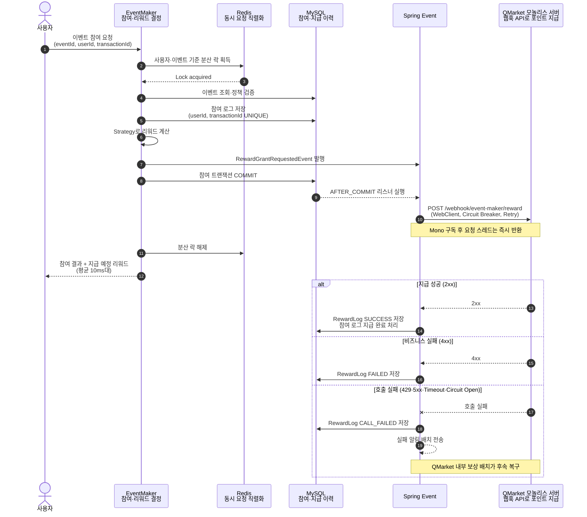
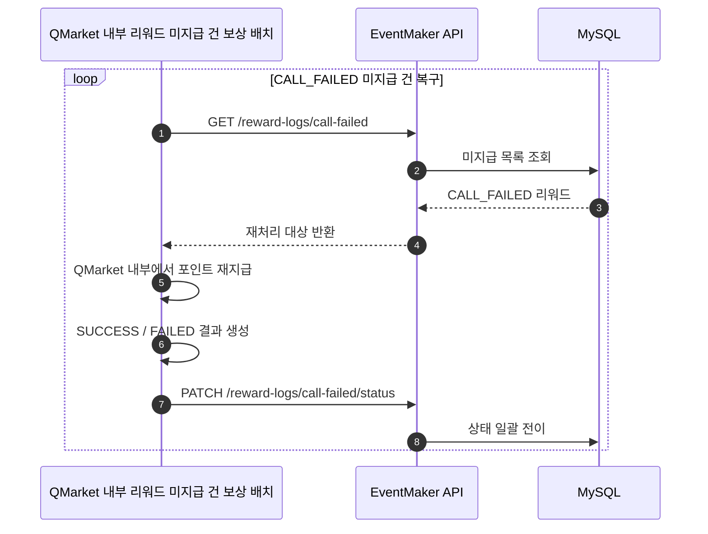

EventMaker는 사용자의 이벤트 참여를 검증하고 지급할 리워드를 결정합니다. 실제 포인트 지급은 QMarket 서버가 웹훅 API를 통해 처리합니다. 따라서 QMarket이 느리거나 중단되더라도 참여 기록이 롤백되지 않아야 하고, 지급하지 못한 리워드는 QMarket 내부 보상 배치가 나중에 복구할 수 있어야 했습니다.

단순히 외부 API를 호출하는 기능보다 **참여 트랜잭션과 보상 지급의 경계를 어디에 둘지**, **동시 요청에도 참여 횟수와 지급 내역을 어떻게 일관되게 유지할지**, **외부 장애가 장기화돼도 미지급 건을 어떻게 최종 복구할지**가 핵심 과제였습니다.

## 리워드 지급 처리 흐름



> 이하 각 사례의 문제, 해결, 결과는 같은 번호로 대응합니다.

## 1. 참여 처리와 외부 리워드 지급을 분리했습니다

### 문제

1. **외부 응답 시간이 사용자 대기 시간으로 전파:** 초기 구현은 QMarket 웹훅 응답을 `block()`으로 기다렸습니다. 참여 검증과 DB 저장이 이미 끝났더라도 외부 API가 응답할 때까지 요청 스레드는 반환되지 않았습니다. QMarket 응답에 200~300ms가 걸리면 사용자는 이벤트 참여 결과를 받기 위해 같은 시간을 추가로 기다려야 했습니다.
2. **참여 확정 전 외부 부수 효과 실행 위험:** 포인트 지급은 외부 시스템의 상태를 바꾸므로 DB 트랜잭션과 함께 롤백할 수 없습니다. 참여 로그 저장이 실패했는데 포인트 지급 요청만 전달되면, 참여 이력은 없지만 리워드는 지급된 불일치가 생길 수 있었습니다. 외부 호출은 참여 데이터의 커밋이 확정된 뒤에만 시작해야 했습니다.
3. **지급 결과 저장과 참여 트랜잭션의 결합:** 외부 응답 결과를 기존 참여 트랜잭션에 이어서 처리하면 QMarket의 지연이나 응답 처리 예외가 사용자 요청 경로를 다시 붙잡습니다. 참여 확정과 지급 결과 기록은 서로 다른 실패 주기를 가지므로 트랜잭션도 분리할 필요가 있었습니다.

### 해결

1. **WebClient 논블로킹 전환:** `RewardGrantClient` 반환 타입을 `RewardGrantResult`에서 `Mono<RewardGrantResult>`로 바꾸고 `block()`을 제거했습니다. 리스너는 Reactor 파이프라인을 `subscribe()`한 뒤 즉시 반환하도록 구성했습니다.
2. **커밋 이후 외부 호출:** 참여 트랜잭션에서는 이벤트 조회, 정책 검증, 참여 로그 저장, Strategy 기반 리워드 계산까지만 처리했습니다. `RewardGrantRequestedEvent`를 발행하고 `@TransactionalEventListener(AFTER_COMMIT)`에서 웹훅을 호출해 커밋 성공 후에만 포인트 지급을 시작했습니다.
3. **지급 결과용 독립 트랜잭션:** QMarket 응답을 `RewardGrantClientCalledEvent`로 전달하고, `REQUIRES_NEW` 트랜잭션에서 `RewardLog`와 참여 로그의 지급 상태를 갱신했습니다.

```text
참여 트랜잭션 → COMMIT → QMarket 웹훅 호출 → 지급 결과 트랜잭션
```

### 결과

1. **사용자 응답 시간 단축:** 참여 API 처리 시간이 **200~300ms에서 평균 10ms대**로 약 **95%** 단축됐습니다. 요청 스레드가 외부 응답을 기다리지 않아 동시 처리 여유도 확보했습니다.
2. **참여 데이터와 외부 지급 순서 보장:** 참여 로그가 커밋된 요청에 대해서만 QMarket 포인트 지급을 시작하도록 경계를 명확히 했습니다.
3. **장애 전파 범위 축소:** QMarket 지연·장애와 지급 결과 저장 실패가 이미 완료된 참여 트랜잭션을 롤백하지 않게 했습니다.

## 2. 다중 인스턴스·다중 디바이스의 중복 참여를 차단했습니다

### 문제

1. **동일 사용자의 참여 제한 초과:** 사용자가 여러 기기에서 동시에 참여하거나 웹뷰 오류로 버튼 요청이 연속 전송(따닥)되면, 두 요청이 기존 참여 횟수를 같은 값으로 읽을 수 있습니다. 예를 들어 하루 1회 참여 가능한 이벤트에서 두 요청이 모두 "아직 참여하지 않음"으로 판단하면 참여 로그와 리워드가 중복 생성될 수 있었습니다.
2. **동일 거래의 중복 저장:** 네트워크 재전송이나 클라이언트 중복 호출로 같은 `transactionId`가 여러 번 들어올 수 있습니다. 애플리케이션 검증만으로 막으면 검증과 저장 사이의 경쟁 조건이나 Redis 장애·설정 오류가 발생했을 때 같은 거래가 DB에 중복 기록될 가능성이 남습니다.
3. **락 해제와 커밋 순서의 경쟁:** 락이 DB 커밋보다 먼저 해제되면 다음 요청이 진입했을 때 이전 요청의 변경사항이 아직 보이지 않을 수 있습니다. 이 경우 분산 락을 사용해도 다음 요청이 오래된 참여 상태를 읽어 중복 검증을 통과할 수 있었습니다.
4. **외부 API 호출로 인한 락 장기 점유:** QMarket 웹훅 응답까지 락 안에서 기다리면 같은 사용자의 다음 요청이 비즈니스 검증 때문이 아니라 외부 네트워크 지연 때문에 대기합니다. 장애 시 락 점유 시간이 길어져 사용자 단위 요청 적체로 이어질 수 있었습니다.

> 다중 디바이스에서 동시(중복) 참여 문제 상황


> 다중 인스턴스 환경에서 따닥으로 인한 중복 참여 문제 상황


### 해결

1. **사용자·이벤트 단위 Redis 분산 락:** `eventId:userId`를 키로 Redisson 락을 획득해 여러 서버와 기기에서 들어온 동일 사용자의 같은 이벤트 요청을 직렬화했습니다. 다음 요청은 이전 요청 처리 후 최신 참여 횟수를 다시 검증합니다.
2. **DB Unique 제약의 최종 방어선:** `participation_logs`에 `(user_id, transaction_id)` Unique 제약을 적용했습니다. 분산 락을 우회한 동일 거래도 DB가 최종 차단하도록 구성했습니다.
3. **락 내부의 독립 트랜잭션:** AOP 내부 비즈니스 로직을 `REQUIRES_NEW` 트랜잭션으로 실행해 `Lock → Transaction → Commit → Unlock` 순서를 보장했습니다.
4. **락 범위를 참여 처리로 제한:** 외부 웹훅은 참여 커밋 이후 논블로킹으로 시작했습니다. 네트워크 응답 대기를 락 점유 구간에서 제외했습니다.

### 결과

1. **참여 정책의 일관된 적용:** 다중 인스턴스·다중 디바이스에서도 같은 사용자와 이벤트의 요청이 최신 참여 상태를 기준으로 순차 검증됩니다. 출석 이벤트 동시 요청 10건에서 1건만 성공하는 시나리오를 통합 테스트로 확인했습니다.
2. **동일 거래의 중복 방지:** 같은 `transactionId`를 사용한 동시 요청 10건에서 1건만 저장됐습니다. Redis와 별개로 DB 제약이 데이터 정합성의 마지막 방어선으로 남습니다.
3. **커밋 결과 가시성 보장:** 다음 요청은 이전 트랜잭션 커밋 이후 락을 획득하므로, 이전 참여 내역을 반영한 정책 검증을 수행합니다.
4. **락 점유 시간 최소화:** QMarket 응답 지연이 사용자별 참여 락을 장시간 점유하지 않게 했습니다.

## 3. 외부 보상 서버 장애를 격리하고 미지급 건을 복구했습니다

### 문제


1. **일시 장애와 영구 실패의 혼재:** QMarket의 429·5xx·네트워크 단절은 시간이 지나면 성공할 수 있지만, 잘못된 요청에 대한 4xx는 같은 요청을 반복해도 성공하기 어렵습니다. 두 실패를 구분하지 않고 모두 재시도하면 복구되지 않는 요청으로 외부 서버와 애플리케이션 자원을 낭비하게 됩니다.
2. **장애 장기화 시 요청과 재시도 누적:** 외부 서버가 느리거나 중단됐는데 호출 상한이 없으면 각 요청이 오랫동안 연결과 메모리를 점유합니다. 이벤트 트래픽이 계속 들어오는 상황에서는 재시도까지 겹쳐 장애가 EventMaker의 자원 고갈로 확산될 수 있었습니다.
3. **온라인 재시도 이후의 미지급 누락:** Retry를 모두 소진했다는 사실은 포인트가 필요 없다는 뜻이 아닙니다. 참여 기록은 정상적으로 남았지만 외부 장애 때문에 지급하지 못한 건을 별도로 보존하지 않으면, 서버가 복구된 뒤 어떤 사용자에게 얼마를 다시 지급해야 하는지 찾을 수 없었습니다.

### 해결

1. **실패 상태와 재시도 조건 분리:** 복구 가능성이 낮은 4xx는 `FAILED`, 네트워크 오류·429·5xx·타임아웃은 `CALL_FAILED`로 구분했습니다. Retry도 네트워크 오류·429·5xx에만 최대 3회 적용했습니다.
2. **Timeout과 Circuit Breaker:** WebClient에 연결 3초, 요청 5초 타임아웃을 적용했습니다. Retry의 지수 backoff를 포함해 운영 판단 기준 **최대 18초 이내**에 호출을 끝내고, 최근 60초의 실패율이 50%이거나 slow call 비율이 80%에 도달하면 Circuit Breaker가 추가 호출을 빠르게 차단하도록 구성했습니다.
3. **`CALL_FAILED` 보상 배치:** 온라인 호출 실패도 `RewardLog`에 남겼습니다. QMarket 모놀리스 내부 보상 배치가 커서 방식으로 미지급 목록을 조회해 직접 포인트를 재지급하고, 결과를 EventMaker 상태 전이 API로 일괄 반영하도록 구성했습니다.



### 결과

1. **오류별 대응 명확화:** 일시 오류는 온라인 재시도로 흡수하고, 복구 가능성이 낮은 요청은 즉시 `FAILED`로 분류해 불필요한 반복 호출을 줄였습니다.
2. **외부 장애의 전파 제한:** 장애가 지속되면 Circuit Breaker가 불필요한 호출을 빠르게 차단해 EventMaker의 연결과 처리 자원을 보호합니다.
3. **Eventual Consistency 확보:** 장기 장애로 지급하지 못한 건도 `CALL_FAILED`에 남아 배치 재처리 대상으로 최종 수렴합니다.

## 4. 성능 목표와 검증

### 목표 산정

감으로 커넥션 풀을 정하지 않고 실제 피크 사용자 수에서 목표 처리량을 계산했습니다. 최근 1개월의 1분 기준 피크 접속자는 551명이었습니다. 모든 사용자가 해당 1분에 한 번씩 요청한다고 보수적으로 가정하면 약 10 TPS이며, 여기에 2배의 여유를 둔 20 TPS를 목표로 정했습니다.

```text
피크 TPS ≈ 551명 / 60초 ≈ 10 TPS
목표 TPS = 피크 TPS × 2 = 20 TPS

요청당 DB 점유 시간 = DB 왕복 7회 × 200ms = 1.4초
필요 커넥션 = 10 TPS × 1.4초 = 14개
여유 적용 = 14 × 2.5 = 35개
설정값 = maximum-pool-size 40
```

### AWS DLT 부하 테스트

계산과 설정으로 끝내지 않고 **AWS Distributed Load Testing(AWS DLT)** 으로 이벤트 참여 API에 목표 부하를 발생시키는 간단한 테스트를 수행했습니다. 실측 피크의 2배인 20 TPS로 요청을 보내 참여 처리와 DB 커넥션 풀이 목표 구간에서 안정적으로 동작하는지 확인했습니다.

| 항목 | 값 | 판단 근거 |
| --- | --- | --- |
| 최근 1개월 피크 접속자 | 551명/분 | 운영 실측 데이터 |
| 환산 피크 TPS | 약 10 TPS | 551명 ÷ 60초 |
| 목표 TPS | 20 TPS | 피크의 2배 |
| 계산된 DB 커넥션 | 35개 | 리틀의 법칙과 지연 여유 2.5배 |
| HikariCP 설정 | 40개 | 계산값을 상향 적용 |
| 검증 도구 | AWS DLT | 이벤트 참여 API 대상 간단 부하 테스트 |
| 검증 결과 | 20 TPS 안정 동작 | 목표 부하에서 요청 처리 확인 |

## 5. Strategy·Composite 디자인 패턴으로 확장 구조를 만들었습니다

### 문제

1. **리워드 계산 조건문의 증가:** 룰렛과 출석 이벤트는 보상 계산 방식이 다릅니다. 이벤트 유형이 늘 때마다 하나의 서비스에 `if`나 `when` 분기를 추가하면 기존 유형의 계산 로직까지 함께 수정하게 되고, 변경 영향 범위와 테스트 범위가 계속 커질 수 있었습니다.
2. **참여 검증 규칙의 결합:** 이벤트 상태, 참여 가능 시간, 중복 참여, 이벤트별 횟수 제한은 서로 다른 이유로 변경됩니다. 모든 조건을 참여 서비스 한 곳에서 처리하면 규칙 하나를 추가하거나 순서를 바꿀 때 전체 검증 흐름을 수정해야 했습니다.

### 해결

1. **Strategy Pattern 기반 리워드 계산:** `RewardCalculationStrategy` 구현체가 자신이 지원하는 이벤트 유형의 보상을 계산하도록 분리했습니다. 룰렛·출석 계산 로직은 독립된 구현체로 구성했습니다.
2. **Composite Pattern 기반 참여 정책:** 이벤트 상태, 시간, 중복 참여, 이벤트별 규칙을 `ParticipationPolicy`로 분리하고 `CompositePolicy`가 필요한 정책을 순서대로 조합하도록 구성했습니다.

### 결과

1. **Strategy Pattern을 통한 독립적 확장:** 새 이벤트 유형은 기존 계산기 분기를 수정하는 대신 Strategy 구현체를 추가해 확장할 수 있게 됐습니다.
2. **Composite Pattern을 통한 정책 조합:** 참여 서비스는 정책의 세부 구현을 알 필요가 없으며, 규칙 추가·교체·순서 변경이 다른 정책 구현으로 번지지 않게 됐습니다.
