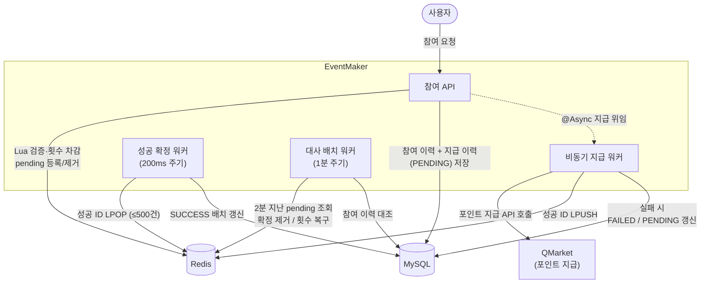
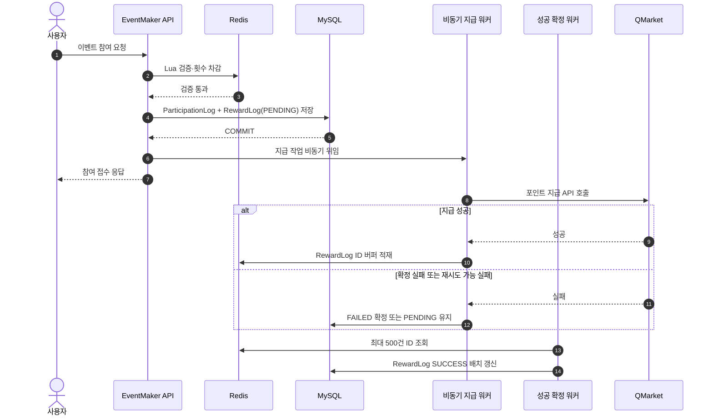
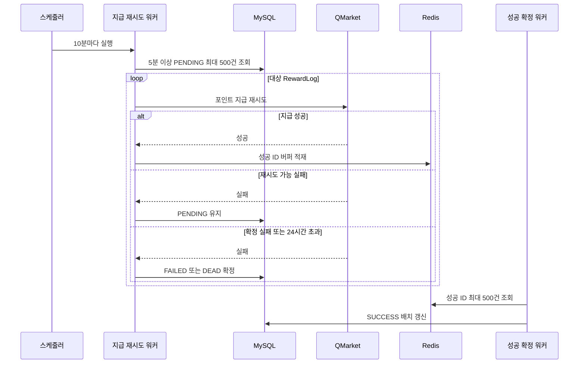
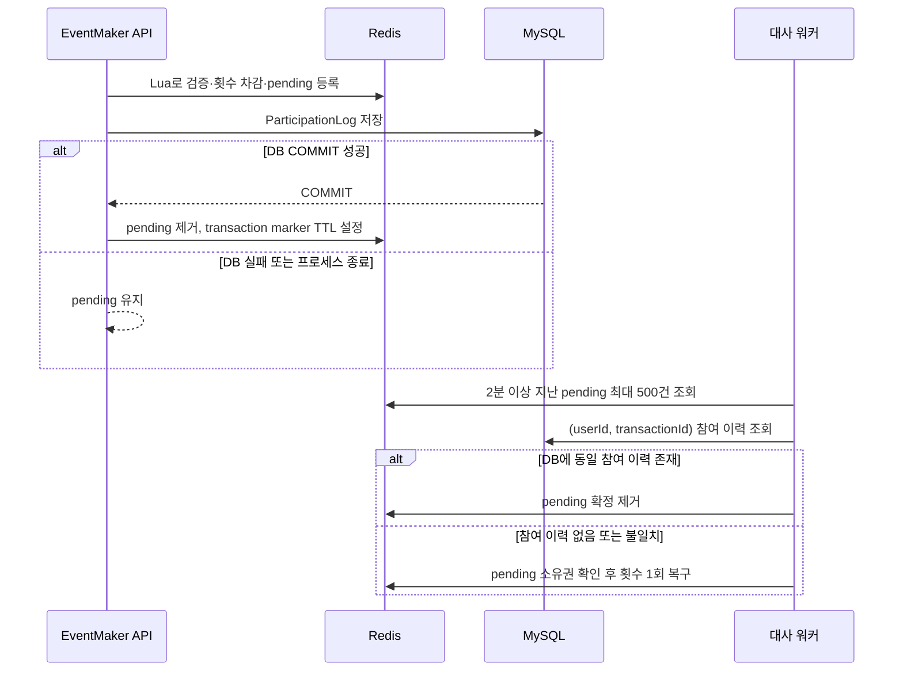

EventMaker(이벤트메이커)는 이벤트 참여 가능 여부를 검증하고, 누가 어떤 리워드를 받을지 결정·기록하는 서비스입니다. 실제 포인트 지급은 별도 시스템인 QMarket(큐마켓)이 담당했습니다.

## 참고) 아키텍처 다이어그램


```mermaid
flowchart TB
    User([사용자])

    subgraph EM[EventMaker]
        API[참여 API]
        Grant[비동기 지급 워커]
        Flusher["성공 확정 워커<br/>(200ms 주기)"]
        Recon["대사 배치 워커<br/>(1분 주기)"]
    end

    Redis[(Redis)]
    DB[(MySQL)]
    QMarket["QMarket<br/>(포인트 지급)"]

    User -->|참여 요청| API
    API -->|"Lua 검증·횟수 차감<br/>pending 등록/제거"| Redis
    API -->|"참여 이력 + 지급 이력(PENDING) 저장"| DB
    API -.->|"@Async 지급 위임"| Grant
    Grant -->|포인트 지급 API 호출| QMarket
    Grant -->|성공 ID LPUSH| Redis
    Grant -->|"실패 시<br/>FAILED / PENDING 갱신"| DB
    Flusher -->|"성공 ID LPOP (≤500건)"| Redis
    Flusher -->|SUCCESS 배치 갱신| DB
    Recon -->|"2분 지난 pending 조회<br/>확정 제거 / 횟수 복구"| Redis
    Recon -->|참여 이력 대조| DB
```

## 참고) 이벤트 참여 요청 시퀀스 다이어그램


```mermaid
sequenceDiagram
    autonumber
    actor User as 사용자
    participant API as EventMaker API
    participant Redis as Redis
    participant DB as MySQL
    participant AsyncWorker as 비동기 지급 워커
    participant Flusher as 성공 확정 워커
    participant QMarket as QMarket

    User->>API: 이벤트 참여 요청
    API->>Redis: Lua 검증·횟수 차감
    Redis-->>API: 검증 통과
    API->>DB: ParticipationLog + RewardLog(PENDING) 저장
    DB-->>API: COMMIT
    API->>AsyncWorker: 지급 작업 비동기 위임
    API-->>User: 참여 접수 응답

    AsyncWorker->>QMarket: 포인트 지급 API 호출
    alt 지급 성공
        QMarket-->>AsyncWorker: 성공
        AsyncWorker->>Redis: RewardLog ID 버퍼 적재
    else 확정 실패 또는 재시도 가능 실패
        QMarket-->>AsyncWorker: 실패
        AsyncWorker->>DB: FAILED 확정 또는 PENDING 유지
    end

    Flusher->>Redis: 최대 500건 ID 조회
    Flusher->>DB: RewardLog SUCCESS 배치 갱신
```

## 1. 개발의 불편함으로 고객의 불편함을 해소

### 문제 상황

초기 구조는 참여 기록 후 큐마켓 지급 API를 동기로 호출했습니다. 평소 참여 응답은 100ms 이하였지만, 개발 환경 배포 후 테스트 중 간헐적으로 지급 API가 지연되어 500~600ms까지 증가했습니다. 이벤트메이커가 제어할 수 없는 외부 시스템 지연이 그대로 사용자 응답 시간에 전파되는 구조였습니다.

개발 환경에서 간헐적으로 재현된 문제였지만, 운영 환경에서도 같은 현상이 발생하면 사용자는 이벤트 참여 자체가 느리다고 인식할 수 있었습니다. 이에 '참여 접수'는 동기로 유지하되, QMarket API를 호출하는 '리워드 지급'은 비동기로 분리하는 방안을 기획자분께 제안해 적용했습니다.

그러나 `@Async`로 호출만 분리하면 참여 응답 이후 지급 작업이 실패하거나 유실될 수 있었습니다. 지급 결과를 알 수 없는 ReadTimeout 상황에서 같은 `transactionId`로 재시도하면 중복 지급이 발생할 가능성도 있었습니다.

### 해결

지급 이력(`RewardLog`)에 다음 상태 머신을 추가했습니다.
- `PENDING`: 지급 대기/재시도 대상
	- 외부 API 장애로 지급하지 못한 건을 유지해 재시도 워커가 회수하도록 했습니다.
- `SUCCESS`: 지급 성공
- `FAILED`: 확정 실패
	- 존재하지 않는 사용자 등 4xx 응답은 재시도하지 않고 실패로 확정했습니다.
- `DEAD`: 재시도 한도를 소진한 상태
	- `PENDING` 상태로 24시간이 지난 건은 `DEAD`로 전환해 관리자가 확인하고 수동 처리하도록 했습니다.

참여 이력(`ParticipationLog`)과 `PENDING` 지급 이력을 같은 트랜잭션으로 저장했습니다. 참여가 기록됐지만 지급 복구 정보가 없는 상태를 방지했습니다.

첫 지급 호출이 QMarket이나 인프라 상황에 따라 일시적으로 실패할 수 있어 별도 재시도 워커를 구성했습니다. 워커는 10분마다 5분 이상 `PENDING`에 머문 건을 최대 500건씩 회수했습니다.
- 5분의 유예기간을 두지 않을 경우, 현재 처리 중인 건을 워커가 가로채어 중복 실행할 수 있기 때문입니다.
- ReadTimeout이 발생하면 QMarket의 실제 지급 여부를 알 수 없어 재요청이 발생할 수 있었습니다. QMarket에도 `(userId, transactionId)` Unique 제약을 두어 중복 지급을 방어했습니다.

#### 참고) 지급 재시도 워커


```mermaid
sequenceDiagram
    participant Scheduler as 스케줄러
    participant RetryWorker as 지급 재시도 워커
    participant DB as MySQL
    participant QMarket as QMarket
    participant Redis as Redis
    participant Flusher as 성공 확정 워커

    Scheduler->>RetryWorker: 10분마다 실행
    RetryWorker->>DB: 5분 이상 PENDING 최대 500건 조회
    loop 대상 RewardLog
        RetryWorker->>QMarket: 포인트 지급 재시도
        alt 지급 성공
            QMarket-->>RetryWorker: 성공
            RetryWorker->>Redis: 성공 ID 버퍼 적재
        else 재시도 가능 실패
            QMarket-->>RetryWorker: 실패
            RetryWorker->>DB: PENDING 유지
        else 확정 실패 또는 24시간 초과
            QMarket-->>RetryWorker: 실패
            RetryWorker->>DB: FAILED 또는 DEAD 확정
        end
    end
    Flusher->>Redis: 성공 ID 최대 500건 조회
    Flusher->>DB: SUCCESS 배치 갱신
```

### 결과

- 변경 전: 평소 **100ms 이하**, 간헐적으로 **500~600ms**까지 지연됐습니다.
- 비동기 지급 전환 후: 관측된 참여 응답이 **모두 100ms 이하**로 유지됐습니다.
	- 간헐적으로 외부 요청이 튀는 상황이 있었으나, 외부 지급 API 지연이 참여 응답 시간에 전파되지 않음을 확인했습니다.
- 외부 지급 API의 지연을 참여 응답 경로에서 분리했습니다.

## 2. 부하테스트를 통한 서비스 처리량과 병목 지점의 발견

### 부하테스트 진행 배경

신규 서비스이자 입사 후 처음 담당한 프로젝트였기에 운영 전 처리 한계와 병목을 확인하고자 했습니다. 당시 분당 활성 사용자 수는 최대 약 600명이었습니다. 푸시 알림 직후의 순간적인 참여 집중까지 고려해 **100 TPS**를 초기 목표로 설정했습니다.

VU를 5부터 50까지 단계적으로 높여 현재 처리량과 포화 지점을 탐색했습니다. 단일 인스턴스 처리량은 목표의 4.5배인 **456 TPS**까지 도달했습니다.

다만 VU 25부터 HikariCP 커넥션 대기(pending)가 증가했습니다. 이후 부하를 높여도 TPS는 늘지 않고 응답 시간만 증가하는 포화 상태가 나타났습니다.

> VU 5→50 부하테스트의 TPS·응답 시간·HikariCP 커넥션 추이 — TPS는 최대 459 req/s까지 올랐고, 이 지점부터 커넥션 대기(Pending)가 함께 증가


초기 목표는 달성했지만 푸시 알림으로 트래픽이 집중되는 상황까지 수용하기 위해 목표를 **1000 TPS**로 높였습니다.
### 문제

커넥션 대기가 직접적인 포화 신호였기 때문에 HikariCP 풀을 10개에서 20개, 40개로 늘려가며 재측정했습니다.

커넥션 대기는 줄었지만 처리량은 오히려 하락했고 응답 시간은 증가했습니다.

> 커넥션 풀을 40개로 늘린 뒤에도 TPS는 오히려 하락하고 응답 시간은 늘었으며, 커넥션 대기(빨간선)도 최대 90까지 증가


원인은 DB 커넥션 수가 아니라 애플리케이션 CPU 한계였습니다. 커넥션 풀이 더 많은 요청을 동시에 실행시키자 2vCPU 인스턴스의 CPU가 100%에 도달했습니다. 이를 통해, **단일 인스턴스의 실질적인 처리 한계가 약 450~480 TPS**임을 확인했습니다.

### 해결 및 결과

애플리케이션 CPU 한계를 수평 확장으로 해결하기 위해 WAS를 3대로 늘려 재측정했습니다.

> WAS 3대로 수평 확장 후 재측정한 TPS·응답 시간과 인스턴스별 CPU 사용률 — 처리량은 최대 864 req/s로 늘고 CPU는 안정 구간(약 25~50%)에서 유지됨


처리량은 **456 TPS에서 847 TPS로 1.86배 증가**했고, 단일 WAS의 CPU 사용률도 안정화됐습니다. 그러나 VU 50 이후에는 부하를 높여도 처리량이 증가하지 않고 응답 시간만 늘었습니다. 병목이 애플리케이션에서 다른 계층으로 이동했음을 확인했습니다.

## 3. 100 TPS에서 2193 TPS로
### 문제앱

스케일아웃 후 애플리케이션 CPU는 안정됐지만 처리량은 847 TPS에서 정체됐습니다. DB와 Redis 지표를 확인한 결과 DB CPU가 **85.4%** 까지 올라 새로운 병목이 됐습니다.

슬로우 쿼리 문제인지 확인하기 위해 `performance_schema`를 분석했습니다. 병목의 중심은 쿼리 실행보다 COMMIT 대기였으며, 참여 요청 한 건당 커밋이 세 번 발생하고 있었습니다.

```sql
mysql> SELECT
    ->     DIGEST_TEXT                              AS `구문`,
    ->     COUNT_STAR                                AS `횟수`,
    ->     ROUND(AVG_TIMER_WAIT / 1000000000, 3)     AS `평균(ms)`,
    ->     ROUND(SUM_TIMER_WAIT / 1000000000000, 0)  AS `총 시간(초)`
    -> FROM performance_schema.events_statements_summary_by_digest
    -> ORDER BY SUM_TIMER_WAIT DESC LIMIT 4;
+-------------------------------------+----------+----------+-------------+
| 구문                                 | 횟수      | 평균(ms)  |    총 시간(초) |
+-------------------------------------+----------+----------+-------------+
| COMMIT                              |  5120203 |    5.180 |       26524 |
| SET autocommit=?                    | 10250034 |    0.034 |         350 |
| SET SESSION TRANSACTION READ WRITE  |  1707108 |    0.033 |          56 |
| SET SESSION TRANSACTION READ ONLY   |  1707071 |    0.032 |          54 |
+-------------------------------------+----------+----------+-------------+
4 rows in set (0.02 sec)
```

- Event 조회를 위한 `@Transactional(readOnly = true)` 커밋
- `ParticipationLog`와 `RewardLog` INSERT 커밋
- `RewardLog`를 `PENDING`에서 `SUCCESS` 또는 `FAILED`로 변경하는 커밋

즉, DB CPU 한계와 요청마다 반복되는 커밋이 대기까지 만들고 있었습니다.

### 해결

기존에는 참여 한 건마다 이벤트, 이벤트 타입별 세부 정보, 중복 참여, 당일 참여 횟수를 DB에서 조회하고 Redisson 분산 락을 획득·해제했습니다. 검증이 트랜잭션 안에 있어 DB 왕복 동안 커넥션을 오래 점유했고, 거절될 요청도 DB 자원을 사용했습니다.

- 이벤트 상태와 정책 계산 데이터를 Redis Hash에 캐싱했습니다.
- Lua Script 한 번으로 이벤트 상태·기간·stale 여부·중복 참여·일일 참여 횟수를 검증하고 참여 횟수 증가까지 원자적으로 실행했습니다.
- 검증과 차감이 하나의 원자 연산이 되면서 Redisson 분산 락도 제거할 수 있었습니다.

이를 통해 요청당 DB 검증 조회 네 번과 Redis 분산 락 왕복을 제거했습니다. 하지만 아직 커밋 대기 문제가 남아있었습니다. 앞선 검증 프로세스 개선으로 Event 조회용 읽기 전용 트랜잭션은 사라졌지만, 참여·지급 이력 저장과 지급 상태 변경을 위한 두 번의 커밋은 남아있었습니다.

참여 이력과 `PENDING` 지급 이력은 복구의 기준이므로 유실되지 않아야 하기에 요청 시점에 함께 커밋하고 있었고, 이 커밋은 제거하기가 어렵다고 판단했습니다. 반면, `RewardLog`의 지급 성공 상태는 요청마다 즉시 커밋할 필요가 없었습니다.

이에 **지급 성공한 `RewardLog` ID를 Redis List에 모으고, 별도 워커가 200ms마다 최대 500건을 한 트랜잭션으로 갱신하도록 설계**했습니다. Redis 장애로 성공 ID가 유실되더라도 DB에는 `PENDING` 이력이 남으므로 기존 재시도 워커가 다시 회수할 수 있었습니다.

### 결과

- 처리량 개선: **847 TPS → 2193 TPS**
	- **2.59배**, 증가율로는 **약 159% 증가**했습니다.
	- 초기 목표 1000 TPS의 **2.19배**를 달성했습니다.
- 개선 후 p99 응답 시간: **50ms**
- 에러 0건, 중복·일일 횟수·로그 정합성 검사를 통과했습니다.

처리량은 2.59배 증가했지만 DB CPU는 **82.6%** 로 여전히 높았습니다. `performance_schema`를 다시 확인한 결과, 여전히 COMMIT 대기가 남아 있었습니다. 참여 이력과 `PENDING` 지급 이력을 보존하기 위해 유지한 요청당 한 번의 커밋이 병목이었습니다.

다만 처리량이 2.59배 증가했는데도 DB CPU는 기존 85.4%보다 낮은 82.6%를 유지했습니다. 총 CPU 사용률만 보면 변화가 작지만, **요청 한 건당 DB 비용은 크게 줄었다**고 판단했습니다.

남은 커밋 병목을 해결하기 위해 다음 대안을 검토했습니다.
- 인메모리 버퍼를 통한 참여 이력 및 PENDING 상태 리워드 지급 이력 배치 커밋
- Redis List: 검증 성공 시 `LPUSH`하고 별도 워커가 `RPOP`해 배치 커밋
- Redis Streams: 검증 성공 시 `XADD`하고 Consumer Group이 배치 커밋
- RabbitMQ 또는 Kafka 같은 메시지 브로커 도입

그러나 스파이크 대응 목표였던 1000 TPS의 두 배가 넘는 **2193 TPS**를 달성했습니다. 추가 인프라와 운영 복잡도를 도입할 단계는 아니라고 판단해 성능 개선은 여기서 마무리했습니다. 매력적으로 보였던 Redis Streams나 메시지 브로커는 이후 트래픽 증가하여 정말 병목 개선이 필요할 때 적용할 대안으로 남겼습니다.

## 4. 캐시와 DB 데이터 간 정합성 보장을 위한 대사 시스템 구축

### 문제

앞서 Redis를 통해 검증을 진행하고 검증 통과 시, DB에 INSERT 하는 전략을 취해 DB 부하를 크게 줄일 수 있었습니다. 다만, 새롭게 생긴 문제는 정합성이 깨질 수 있다는 것이었습니다.

이를 위해 Redis에서 참여 횟수를 먼저 증가시키고 DB에 동기 저장하면, **DB 저장 실패 시 보상 로직**이 필요했습니다. 그러나 Redis 검증 통과 직후 프로세스 종료, DB 롤백 후 Redis 정리(보상) 전 종료, 보상 명령 실패 등의 상황에서는 Redis 값을 되돌려야 하는지 안전하게 판정할 수 없었습니다.

즉, 보상 트랜잭션의 애매함이 남아있었습니다.

### 해결

**DB를 참여 사실의 최종 기준**으로 두고, Redis에는 DB 저장 결과를 아직 확정하지 못한 참여 예약 건들을 남기는 방식으로 바꿨습니다. 이 참여 예약 건들은 DB 저장 성공 시 제거됩니다.


```mermaid
sequenceDiagram
    participant API as EventMaker API
    participant Redis as Redis
    participant DB as MySQL
    participant Worker as 대사 워커

    API->>Redis: Lua로 검증·횟수 차감·pending 등록
    API->>DB: ParticipationLog 저장
    alt DB COMMIT 성공
        DB-->>API: COMMIT
        API->>Redis: pending 제거, transaction marker TTL 설정
    else DB 실패 또는 프로세스 종료
        API-->>API: pending 유지
    end

    Worker->>Redis: 2분 이상 지난 pending 최대 500건 조회
    Worker->>DB: (userId, transactionId) 참여 이력 조회
    alt DB에 동일 참여 이력 존재
        Worker->>Redis: pending 확정 제거
    else 참여 이력 없음 또는 불일치
        Worker->>Redis: pending 소유권 확인 후 횟수 1회 복구
    end
```

참여 요청에서는 Redis Lua Script 하나로 다음 작업을 원자적으로 처리했습니다.

- 이벤트 상태·기간·중복·일일 횟수 검증
- 사용자별 일일 참여 횟수 증가
- `transactionId` 선점 marker 생성
- 대사 대상 pending을 ZSET에 등록

DB 저장이 성공하면 요청 경로에서 즉시 pending을 제거하고 marker에는 5분 TTL을 설정합니다. 이 **Redis 정리 요청이 실패해도 이미 DB에 참여 이력이 있으므로 사용자 응답을 실패로 바꾸지 않습니다**. 대사 워커가 이후 DB 이력을 확인해 pending을 제거합니다.

반대로 DB 저장에서 예외가 발생하면 요청 경로에서 Redis 카운터를 즉시 되돌리지 않습니다. 이 시점에는 DB COMMIT 결과를 확정할 수 없기 때문입니다. pending을 남긴 뒤 대사 워커가 판단하도록 경계를 분리했습니다.

워커는 1분마다 실행하며, 참여 처리 중인 트랜잭션과 경합하지 않도록 2분 이상 유예된 항목만 최대 500건씩 처리합니다.

- DB에 `eventId`, `userId`, `transactionId`이 같은 이력이 있으면 pending 데이터를 확정 제거합니다.
- DB에 이력이 없거나 다르면 pending을 원자적으로 제거하고 카운터를 1회 감소시킵니다.
- 대사 중 Redis·DB 오류가 나도 pending 데이터만 있다면 다음 주기의 대사 배치가 처리할 수 있습니다.
### 결과

Redis 선차감과 DB 저장 사이에 프로세스가 종료되거나 보상 명령이 실패해도, 즉시 보상 로직의 성공 여부에 의존하지 않게 됐습니다. DB에 남은 참여 이력이 있으면 Redis를 확정 상태로 정리하고, DB에 이력이 없으면 Redis 카운터를 복구합니다.

실제 Redis와 DB를 연결한 통합 테스트로 `Redis 검증 성공 -> DB 미저장 -> 2분 유예 -> 대사 실행` 프로세스를 검증했습니다. 이때 일일 카운터가 0으로 복구되고 pending이 제대로 제거되는 것을 확인했습니다. DB 저장 성공, Redis 정리 실패 후 재시도도 모두 통합 테스트로 검증했습니다.

다만, DB 트랜잭션이 2분보다 길게 열리거나 Redis 데이터 전체가 유실되는 상황은 자동으로 안전하게 판정하지 않고, 알림을 보내고 CS·운영 보정 대상으로 남겼습니다.
