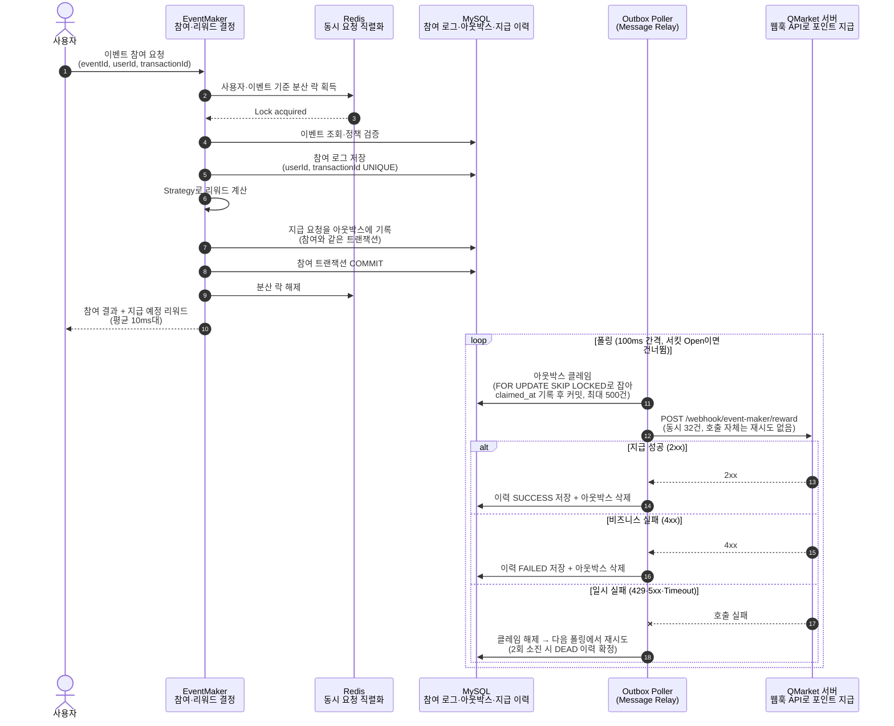
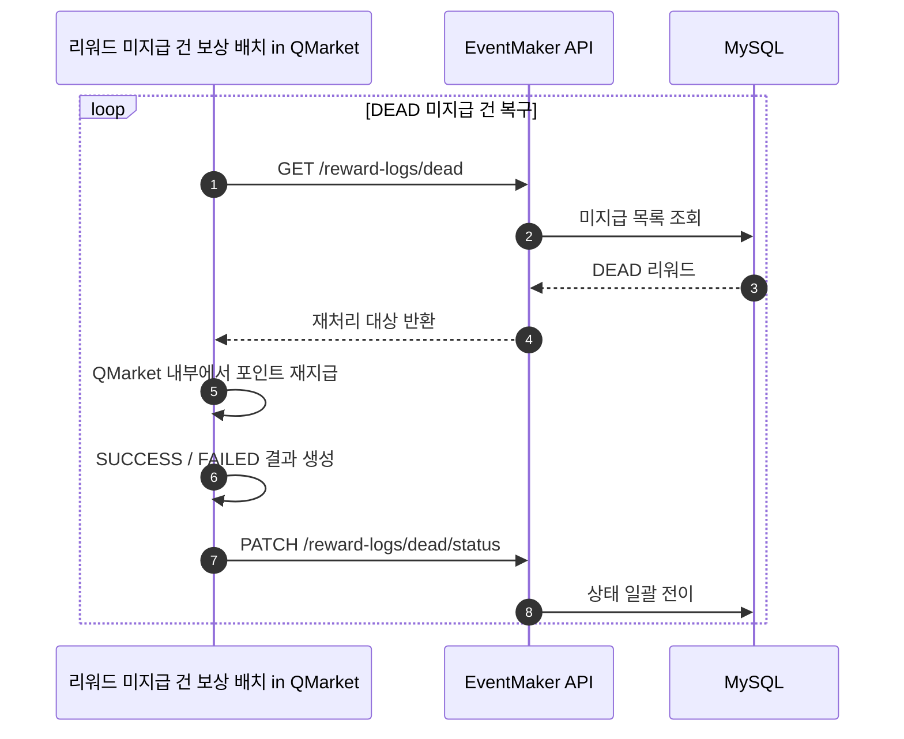
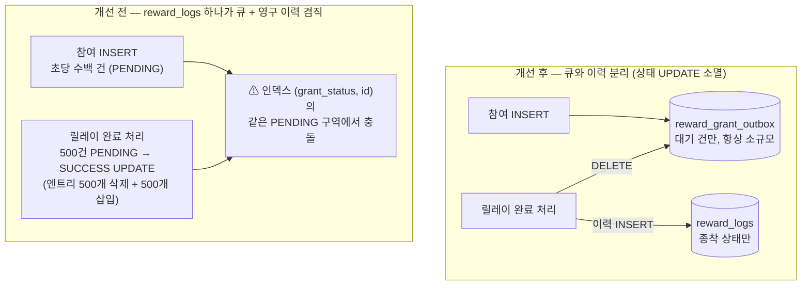

EventMaker는 사용자의 이벤트 참여를 검증하고 지급할 리워드를 결정합니다. 실제 포인트 지급은 QMarket 서버가 웹훅 API를 통해 처리합니다. 따라서 QMarket이 느리거나 중단되더라도 참여 기록이 롤백되지 않아야 하고, 한 번 결정된 리워드는 어떤 장애 구간에서도 유실되지 않고 언젠가 반드시 지급되어야 했습니다.

단순히 외부 API를 호출하는 기능보다 **참여 트랜잭션과 보상 지급의 경계를 어디에 둘지**, **동시 요청에도 참여 횟수와 지급 내역을 어떻게 일관되게 유지할지**, **외부 장애가 장기화돼도 미지급 건을 어떻게 최종 복구할지**가 핵심 과제였습니다.

## 리워드 지급 처리 흐름

```mermaid
sequenceDiagram
    autonumber
    actor User as 사용자
    participant API as EventMaker<br/>참여·리워드 결정
    participant Lock as Redis<br/>동시 요청 직렬화
    participant DB as MySQL<br/>참여 로그·아웃박스·지급 이력
    participant Relay as Outbox Poller<br/>(Message Relay)
    participant QMarket as QMarket 서버<br/>웹훅 API로 포인트 지급

    User->>API: 이벤트 참여 요청<br/>(eventId, userId, transactionId)
    API->>Lock: 사용자·이벤트 기준 분산 락 획득
    Lock-->>API: Lock acquired
    API->>DB: 이벤트 조회·정책 검증
    API->>DB: 참여 로그 저장<br/>(userId, transactionId UNIQUE)
    API->>API: Strategy로 리워드 계산
    API->>DB: 지급 요청을 아웃박스에 기록<br/>(참여와 같은 트랜잭션)
    API->>DB: 참여 트랜잭션 COMMIT
    API->>Lock: 분산 락 해제
    API-->>User: 참여 결과 + 지급 예정 리워드<br/>(평균 10ms대)

    loop 폴링 (100ms 간격, 서킷 Open이면 건너뜀)
        Relay->>DB: 아웃박스 클레임<br/>(FOR UPDATE SKIP LOCKED로 잡아<br/>claimed_at 기록 후 커밋, 최대 500건)
        Relay->>QMarket: POST /webhook/event-maker/reward<br/>(동시 32건, 호출 자체는 재시도 없음)
        alt 지급 성공 (2xx)
            QMarket-->>Relay: 2xx
            Relay->>DB: 이력 SUCCESS 저장 + 아웃박스 삭제
        else 비즈니스 실패 (4xx)
            QMarket-->>Relay: 4xx
            Relay->>DB: 이력 FAILED 저장 + 아웃박스 삭제
        else 일시 실패 (429·5xx·Timeout)
            QMarket--xRelay: 호출 실패
            Relay->>DB: 클레임 해제 → 다음 폴링에서 재시도<br/>(2회 소진 시 DEAD 이력 확정)
        end
    end
```

## 1. 트랜잭션 경계 분리를 통한 참여 응답 95% 단축과 Transactional Outbox를 통한 지급 유실 차단

> 아웃박스 기반 지급 처리 구조 — 참여 트랜잭션 하나가 참여 로그와 아웃박스를 함께 남기고, 폴러가 선점·호출·결과 반영을 담당

#### 외부 응답 시간이 사용자 대기 시간으로 전파

- **문제**: 초기 구현은 참여 트랜잭션 안에서 QMarket 웹훅 응답을 `block()`으로 기다렸습니다. 참여 검증과 DB 저장이 이미 끝났더라도 외부 API가 응답할 때까지 요청 스레드는 반환되지 않았습니다. QMarket 응답에 200~300ms가 걸리면 사용자는 이벤트 참여 결과를 받기 위해 같은 시간을 추가로 기다려야 했습니다.
- **해결**: 지급 호출을 요청 경로에서 완전히 분리했습니다. 참여 트랜잭션은 이벤트 조회, 정책 검증, 참여 로그 저장, 리워드 계산, 아웃박스 기록까지만 처리하고 즉시 응답합니다. 실제 지급 호출은 스케줄러(Outbox Poller)가 100ms 간격으로 아웃박스를 폴링해 최대 500건씩, 동시 32건으로 배치 수행하고, 지급 결과도 릴레이의 독립 트랜잭션이 이력 테이블(`reward_logs`)에 종착 상태(SUCCESS·FAILED·DEAD)로 확정한 뒤 아웃박스에서 삭제합니다.
- **결과**: 참여 API 처리 시간이 **200~300ms에서 평균 10ms대**로 약 **95%** 단축됐습니다. 요청 경로에서 외부 호출이 사라져 동시 처리 여유를 확보했고, QMarket 지연·장애와 지급 결과 저장 실패가 이미 완료된 참여 트랜잭션과 사용자 응답에 영향을 주지 않습니다.

#### 참여 확정 전 외부 부수 효과 실행 위험

- **문제**: 포인트 지급은 외부 시스템의 상태를 바꾸므로 DB 트랜잭션과 함께 롤백할 수 없습니다. 참여 로그 저장이 실패했는데 포인트 지급 요청만 전달되면, 참여 이력은 없지만 리워드는 지급된 불일치가 생길 수 있었습니다. 외부 호출은 참여 데이터의 커밋이 확정된 뒤에만 시작해야 했습니다.
- **해결**: **Transactional Outbox** 패턴을 사용하여 지급 요청을 참여와 같은 트랜잭션으로 `reward_grant_outbox` 행에 기록했습니다. 별도 커밋이나 이벤트 발행이 없고, 릴레이는 커밋된 행만 읽을 수 있으므로 참여 커밋이 확정되기 전에는 지급이 시작될 수 없습니다. 참여가 롤백되면 지급 요청도 함께 사라집니다.
- **결과**: 참여 로그가 커밋된 요청에 대해서만 지급이 시작됩니다. 참여 이력 없이 리워드만 지급되는 불일치가 구조적으로 불가능해졌습니다.

#### 커밋 이후 비동기 처리의 지급 요청 유실

- **문제**: 커밋 직후 메모리에서 지급을 시작하는 방식(스프링 이벤트 리스너 등)은 커밋과 호출 사이에 인스턴스가 재시작되면 지급 요청이 흔적 없이 사라집니다. 참여는 남았는데 지급 요청은 어디에도 없어, 무엇을 복구해야 하는지조차 알 수 없습니다. 지급 요청 자체가 참여와 함께 저장 장치에 남아야 했습니다.
- **해결**: 지급 요청이 메모리가 아닌 DB 행으로 남으므로 재시작해도 사라지지 않습니다. 릴레이의 선점(claim)은 2단계입니다 — 짧은 트랜잭션에서 `SELECT ... FOR UPDATE SKIP LOCKED`로 다른 인스턴스와 겹치지 않게 행을 잡아 `claimed_at`을 기록하고 커밋하면 행 잠금은 풀리고, 외부 호출은 그 트랜잭션 밖에서 수행합니다. 잠금이 없는 호출 구간의 중복 선점은 `claimed_at`이 막고, 호출 중 인스턴스가 죽으면 `claimed_at`이 120초 뒤 만료되어 다른 인스턴스가 재선점합니다. 이 과정에서 생길 수 있는 중복 전달(at-least-once)은 QMarket 멱등키(userId + transactionId)가 중복 지급으로 이어지지 않게 막습니다.
- **결과**: 참여가 커밋되면 지급 요청도 반드시 함께 남고, 어느 구간에서 인스턴스가 죽어도 지급 요청이 유실되지 않습니다.

## 2. 분산 락과 DB 유니크 제약을 통한 다중 인스턴스·디바이스 중복 참여 차단

#### 동일 사용자의 참여 제한 초과

- **문제**: 사용자가 여러 기기에서 동시에 참여하거나 웹뷰 오류로 버튼 요청이 연속 전송(따닥)되면, 두 요청이 기존 참여 횟수를 같은 값으로 읽을 수 있습니다. 예를 들어 하루 1회 참여 가능한 이벤트에서 두 요청이 모두 "아직 참여하지 않음"으로 판단하면 참여 로그와 리워드가 중복 생성될 수 있었습니다.

> 다중 디바이스에서 동시(중복) 참여 문제 상황

> 다중 인스턴스 환경에서 따닥으로 인한 중복 참여 문제 상황

- **해결**: `eventId:userId`를 키로 Redisson 분산 락을 획득해 여러 서버와 기기에서 들어온 동일 사용자의 같은 이벤트 요청을 직렬화했습니다. 다음 요청은 이전 요청 처리 후 최신 참여 횟수를 다시 검증합니다.
- **결과**: 다중 인스턴스·다중 디바이스에서도 같은 사용자와 이벤트의 요청이 최신 참여 상태를 기준으로 순차 검증됩니다. 출석 이벤트 동시 요청 10건에서 1건만 성공하는 시나리오를 통합 테스트로 확인했습니다.

#### 동일 거래의 중복 저장

- **문제**: 네트워크 재전송이나 클라이언트 중복 호출로 같은 `transactionId`가 여러 번 들어올 수 있습니다. 애플리케이션 검증만으로 막으면 검증과 저장 사이의 경쟁 조건이나 Redis 장애·설정 오류가 발생했을 때 같은 거래가 DB에 중복 기록될 가능성이 남습니다.
- **해결**: `participation_logs`에 `(user_id, transaction_id)` Unique 제약을 적용했습니다. 분산 락을 우회한 동일 거래도 DB가 최종 차단하도록 구성했습니다.
- **결과**: 같은 `transactionId`를 사용한 동시 요청 10건에서 1건만 저장됐습니다. Redis와 별개로 DB 제약이 데이터 정합성의 마지막 방어선으로 남습니다.

## 3. Circuit Breaker와 아웃박스 재시도 일원화를 통한 외부 장애 격리 및 미지급 건 최종 복구

#### 일시 장애와 영구 실패의 혼재

- **문제**: QMarket의 429·5xx·네트워크 단절은 시간이 지나면 성공할 수 있지만, 잘못된 요청에 대한 4xx는 같은 요청을 반복해도 성공하기 어렵습니다. 두 실패를 구분하지 않고 모두 재시도하면 복구되지 않는 요청으로 외부 서버와 애플리케이션 자원을 낭비하게 됩니다.
- **해결**: 지급 호출 결과를 성공(2xx), 영구 실패(4xx), 일시 실패(429·5xx·타임아웃·네트워크 오류)로 분류했습니다. 영구 실패는 재시도 없이 `FAILED`로 즉시 확정하고, 일시 실패만 재시도 대상으로 남깁니다.
- **결과**: 일시 오류는 폴링 주기마다 반복되는 아웃박스 재시도로 흡수하고, 복구 가능성이 낮은 요청은 즉시 `FAILED`로 분류해 불필요한 반복 호출을 없앴습니다.

#### 호출 시점 재시도의 자원 점유

- **문제**: 실패한 호출을 그 자리에서 backoff를 두고 다시 시도하면, 실패 건 하나가 재시도가 끝날 때까지 배치의 동시 호출 슬롯(32개 중 하나)을 점유합니다. 이는 배치 전체 완료를 붙잡아 폴링이 다음 사이클로 넘어가지 못하게 하고, 외부 서버가 포화 시에는 이런 지연이 겹겹이 쌓여 처리량은 떨어지고 아픈 서버로의 호출만 시도 수만큼 늘어납니다.
- **해결**: 일시 실패는 다음 폴링 주기가 자연스럽게 다시 집어 가게 했습니다. WebClient에는 연결 3초, 요청 5초 타임아웃을 적용해 모든 지급 호출이 5초 이내에 끝납니다. 최근 60초의 실패율이 50%이거나 3초를 넘는 느린 호출 비율이 80%에 도달하면 Circuit Breaker가 열리고, 릴레이는 서킷이 열려 있는 동안 폴링 자체를 건너뜁니다. 선점한 전건이 호출도 못 해보고 재시도 횟수만 소진하는 것을 막기 위해서입니다.
- **결과**: 실패 건이 동시 호출 슬롯을 점유하는 시간이 호출 1회 분량(최대 5초)으로 줄었습니다. 장애가 지속되면 Circuit Breaker가 호출을 차단하고 릴레이가 폴링을 멈춰, 별도의 재시도 간격(backoff) 없이도 아픈 외부 서버에 부하를 더하지 않으면서 EventMaker의 연결과 처리 자원을 보호합니다.

#### 재시도 소진 이후의 미지급 누락

- **문제**: 재시도를 모두 소진했다는 사실은 적립금이 필요 없다는 뜻이 아닙니다. 참여 기록은 정상적으로 남았지만 외부 장애 때문에 지급하지 못한 건을 별도로 보존하지 않으면, 서버가 복구된 뒤 어떤 사용자에게 얼마를 다시 지급해야 하는지 찾을 수 없었습니다.
- **해결**: 재시도가 소진된 건도 버리지 않고 실패 사유와 함께 이력(`reward_logs`)에 `DEAD`로 남겼습니다. EventMaker가 미지급 건 조회 API와 상태 전이 API를 제공하고, 매일 자정 보상 배치가 미지급 목록을 조회해 포인트를 재지급한 뒤 결과를 일괄 반영합니다.

```mermaid
sequenceDiagram
    autonumber
    participant Batch as 리워드 미지급 건 보상 배치 in QMarket
    participant API as EventMaker API
    participant DB as MySQL

    loop DEAD 미지급 건 복구
        Batch->>API: GET /reward-logs/dead
        API->>DB: 미지급 목록 조회
        DB-->>API: DEAD 리워드
        API-->>Batch: 재처리 대상 반환
        Batch->>Batch: QMarket 내부에서 포인트 재지급
        Batch->>Batch: SUCCESS / FAILED 결과 생성
        Batch->>API: PATCH /reward-logs/dead/status
        API->>DB: 상태 일괄 전이
    end
```

- **결과**: 지급 요청은 아웃박스 재시도 → `DEAD` 이력 → 배치 재처리 어느 단계에서도 유실되지 않고, 최종적으로 지급 완료 상태로 수렴합니다.

## 4. Strategy·Composite 패턴을 통한 이벤트 유형·정책의 독립적 확장 구조 확보

#### 리워드 계산 조건문의 증가

- **문제**: 룰렛과 출석 이벤트는 보상 계산 방식이 다릅니다. 이벤트 유형이 늘 때마다 하나의 서비스에 `if`나 `when` 분기를 추가하면 기존 유형의 계산 로직까지 함께 수정하게 되고, 변경 영향 범위와 테스트 범위가 계속 커질 수 있었습니다.
- **해결**: `RewardCalculationStrategy` 구현체가 자신이 지원하는 이벤트 유형의 보상을 계산하도록 분리했습니다(Strategy Pattern). 룰렛·출석 계산 로직은 독립된 구현체로 구성했습니다.
- **결과**: 새 이벤트 유형은 기존 계산기 분기를 수정하는 대신 Strategy 구현체를 추가해 확장할 수 있게 됐습니다.

#### 참여 검증 규칙의 결합

- **문제**: 이벤트 상태, 참여 가능 시간, 중복 참여, 이벤트별 횟수 제한 등의 참여 검증 규칙들은 서로 다른 이유로 변경됩니다. 모든 조건을 참여 서비스 한 곳에서 처리하면 규칙 하나를 추가하거나 순서를 바꿀 때 전체 검증 흐름을 수정해야 했습니다.
- **해결**: 이벤트 상태, 시간, 중복 참여, 이벤트별 규칙을 `ParticipationPolicy`로 분리하고 `CompositePolicy`가 필요한 정책을 순서대로 조합하도록 구성했습니다.
- **결과**: 참여 서비스는 정책의 세부 구현을 알 필요가 없으며, 규칙 추가·교체·순서 변경이 다른 정책 구현으로 번지지 않게 됐습니다.

## 5. 한계 실측 부하테스트를 통한 병목 제거와 800 RPS 준 실시간 지급 검증

> 운영 실측 피크는 분당 접속자 551명, 요청으로 환산하면 약 10 TPS였고, 기존 검증은 그 2배인 "20 TPS에서 안정 동작"까지였습니다. 시스템의 실제 한계가 어디이고 무엇이 먼저 부러지는지 확인하기 위해, 운영과 동일한 자원 제약(서비스별 2 vCPU / 4GB)의 로컬 환경에서 k6로 180 → 1,500 RPS까지 부하를 올리며 실측했습니다. 판정 기준은 지연·에러율이 아니라 **정합성**(참여 == 실제 지급, 전 단계 일치)을 1순위로 뒀습니다.

#### 아웃박스 클레임 시 갭 락으로 인한 참여 API 차단

- **문제:** MySQL 기본 격리수준(`REPEATABLE READ`)에서 클레임 쿼리(`FOR UPDATE SKIP LOCKED`)가 인덱스 갭을 잠그고, 신규 참여 INSERT가 정확히 그 갭에 들어가 주기적으로 차단됐습니다. 차단된 요청들이 커넥션을 쥔 채 대기하는 악순환 때문에 한 번 임계를 넘으면 실행이 끝날 때까지 회복하지 못했습니다.

> 릴레이가 백로그를 잘 따라잡고 있을수록(대기 건 < 배치 500) 스캔이 인덱스 끝까지 가서 마지막 갭을 잠그고, 신규 INSERT가 바로 그 갭에서 차단되는 구조

- **해결:** 같은 트랜잭션 안에 갭 락(팬텀 방지)에 의존하는 로직이 없음을 확인한 뒤, 격리수준을 `READ COMMITTED`로 내려 갭 락을 제거했습니다.
- **결과:**
    - 같은 600 RPS 부하를 격리수준만 바꿔 번갈아 재실행한 대조에서, 실행당 누적 행 잠금 대기 1,391~2,085건 → **0건.**
    - 정지 후 회복하지 못하던 시스템이 스스로 회복하게 됐고, 참여 API를 주기적으로 대기시키던 간섭이 사라졌습니다.

#### 아웃박스 테이블의 큐·영구 이력 겸직으로 인한 주기적 정지

- **문제:** 아웃박스 도입 초기에는 전용 큐 테이블 없이 지급 이력(`reward_logs`) 테이블의 상태 컬럼을 큐로 겸용해, 처리 대기(`PENDING`)와 완료 이력(`SUCCESS`)이 한 테이블에 쌓였습니다. 릴레이의 500건 단위 상태 UPDATE와 초당 수백 건의 신규 참여 INSERT가 같은 인덱스 구역을 두고 충돌하며 주기적 정지를 만들었습니다.

> 한 테이블이 큐와 이력을 겸직할 때: 상태 UPDATE 500건 = 인덱스 엔트리 500개를 `PENDING` 구역에서 지우고 `SUCCESS` 구역에 새로 넣는 대규모 재배치가 발생하고, 신규 INSERT는 바로 그 구역에 들어옴.

```mermaid
flowchart LR
    subgraph before["개선 전 — reward_logs 하나가 큐 + 영구 이력 겸직"]
        direction LR
        I1["참여 INSERT<br/>초당 수백 건 (PENDING)"] --> X["⚠ 인덱스 (grant_status, id)의<br/>같은 PENDING 구역에서 충돌"]
        U1["릴레이 완료 처리<br/>500건 PENDING → SUCCESS UPDATE<br/>(엔트리 500개 삭제 + 500개 삽입)"] --> X
    end

    subgraph after["개선 후 — 큐와 이력 분리 (상태 UPDATE 소멸)"]
        direction LR
        I2["참여 INSERT"] --> OB[("reward_grant_outbox<br/>대기 건만, 항상 소규모")]
        RL["릴레이 완료 처리"] -->|"이력 INSERT"| H[("reward_logs<br/>종착 상태만")]
        RL -->|"DELETE"| OB
    end

    X ~~~ I2
```

- **해결:** 아웃박스 테이블을 신설해 큐와 이력을 분리하여 지금의 처리 흐름을 만들었습니다. 처리 대기 건만 아웃박스에 담고, 완료 시 이력 테이블에 INSERT 후 아웃박스에서 DELETE 하여 인덱스 안을 이동하는 상태 UPDATE 자체를 없앴습니다.
- **결과:**
    - 같은 500 RPS 부하의 분리 전후 대조에서, 정상 구간 서버 p99 **193ms → 22ms(8.8배)**
    - 참여 경로의 커넥션 사용 40개(전부) → 1개로 감소. 같은 인덱스 구역에서의 충돌로 인한 정지가 제거되었습니다.

#### 시스템 한계 실측과 수평 확장 검증

- **문제:** 병목을 제거한 뒤에도 "어디서, 어떻게 부러지는가"와 "인스턴스를 늘리면 한계가 올라가는가"는 실측된 적이 없었습니다.

> 스케일 아웃으로 나뉘는 자원(CPU)과 그대로 공유되는 자원(DB 커밋 경로) — 병목은 사라지지 않고 공유 자원으로 이동한다

- **해결:** 계단 부하(1,000 → 1,500 RPS)로 부러지는 지점과 방식을 확정하고, nginx 로드밸런서 + 스케일 아웃 구성으로 대조 실측을 수행했습니다.
- **결과:**
    - 포화는 한 지점이 아니라 순서로 나타났습니다. 부하를 올려도 시스템은 한 번에 부러지지 않고, 약속이 하나씩 깨졌습니다.
        - **800 RPS**: 깨지는 것 없음. 준 실시간 지급이 유지됨을 반복 확인한 마지막 계단
        - **1,000 RPS**: 지급의 실시간성이 깨짐. 유입량과 폴러 처리량의 균형이 무너져 적체가 커지기 시작
        - **1,200 RPS**: CPU 여유가 깨짐. 앱 CPU가 100%에 고정되고 참여 p99의 지연이 커지기 시작.
        - **1,500 RPS**: 참여 자체는 요청 실패·유실 0으로 깨지지 않았음. p99 110ms, 지급만 최대 36초 지연. 참여 경로의 포화점은 측정 범위 밖임을 확인하고 종료
    - 포화의 형태가 5xx나 유실이 아니라 지급 지연인 것은 아웃박스 구조가 의도한 퇴화 방식입니다 — 과부하는 유실이 아니라 지연으로 변환됩니다.
    - 로컬에서의 스케일 아웃(2대)은 CPU를 나누는 데 성공했지만(인스턴스당 88% → 68%) 병목이 공유 자원인 DB 커밋 경로로 이동해 지연이 오히려 악화됐고, 같은 커밋 수요를 AWS RDS에서 재측정해 이 병목이 로컬 환경의 특수성으로 인한 것이며 운영 디스크에는 현재 수요의 2배 이상 여유가 있음을 확인했습니다.
    - 이후로는 공유 자원인 DB로의 부하를 줄이기 위한 모색이 필요했으나, 오버엔지니어링이라고 판단하여 추가적인 개선은 멈추었습니다.

전 과정에서 데이터 유실은 **모든 부하 구간에서 0건**이었습니다. 단일 인스턴스 기준 실질적 포화점은 지급 균형이 깨지는 **약 1,000~1,250 RPS**이고, 운영과 같은 내구성 설정에서 반복 확인한 보수치는 **800 RPS**입니다. 검증 수준은 "20 TPS 안정 동작"에서 "**800 RPS 준 실시간 지급**"으로 올라갔으며, 이 전체가 운영 피크(약 10 TPS)의 80배 이상 위에 있어 추가 측정은 여기서 멈췄습니다.
