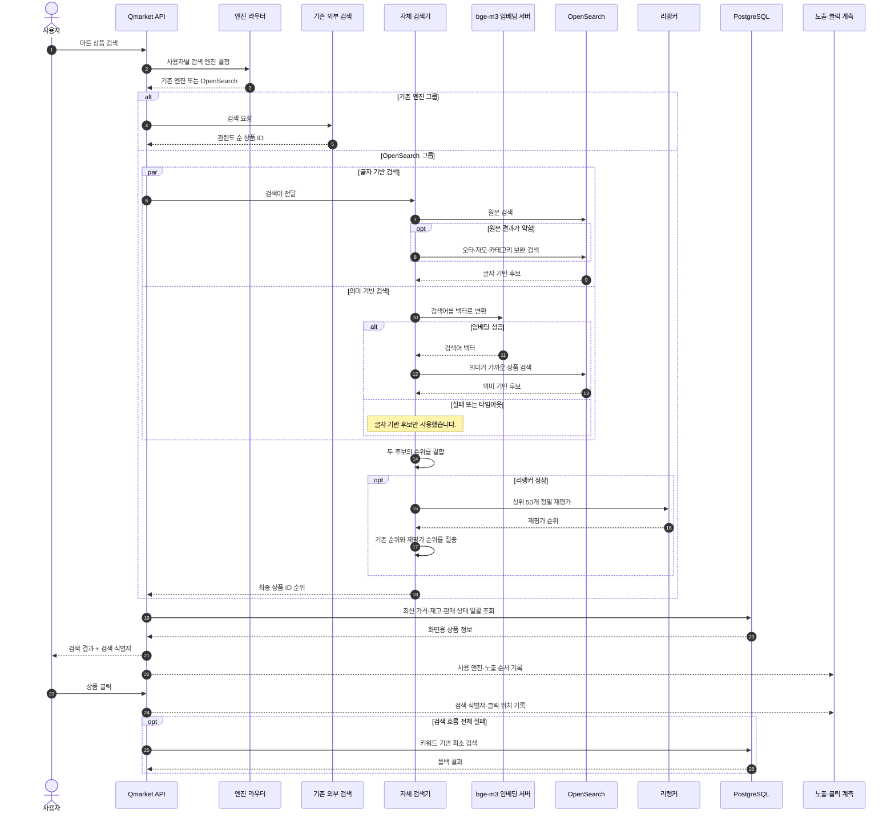
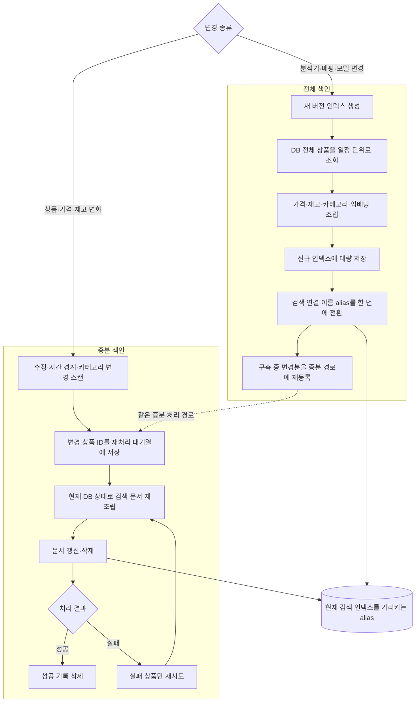

외부 유료 AI 검색 서비스에 의존하던 마트 상품 검색을 OpenSearch 기반 자체 엔진으로 전환한 프로젝트였습니다. 외부 서비스는 검색 순위와 동의어를 직접 개선하기 어렵고, 상품 변경 반영 시점과 장애 대응도 통제하기 어려웠습니다.

따라서 단순 API 교체가 아니라 **품질을 같은 기준으로 증명하고, 상품 정보를 지속적으로 동기화하며, 장애 시 이전 단계로 폴백하고, 실제 사용자 반응을 확인하며 전환하는 시스템**을 구축했습니다.

## 검색 처리 구조

Qmarket API는 검색 엔진에서 관련도 순 상품 ID를 받은 뒤, PostgreSQL에서 최신 가격·재고·판매 상태를 조회해 화면용 결과를 만들었습니다. 기존 외부 검색과 신규 OpenSearch는 같은 인터페이스 뒤에 두고 사용자별로 선택했습니다.

글자 기반 검색, 의미 기반 검색, 리랭킹을 독립된 단계로 구성했습니다. 임베딩이 실패하면 글자 기반 결과를 사용하고, 리랭커가 실패하면 결합된 순서를 유지했습니다. 검색 흐름 전체가 실패하면 DB 키워드 검색을 마지막 안전망으로 사용했습니다.

> 이하 각 사례의 문제와 해결은 같은 번호로 대응합니다.

## 1. 엔진보다 먼저 품질을 측정할 기준을 만들었습니다

### 문제

기존 검색은 외부 서비스 내부의 랭킹 기준을 알 수 없는 블랙박스였습니다. 구체적인 문제와 원인은 다음과 같았습니다.

1. **비교 기준 부재:** 평가할 검색어와 정답 기준이 없어 새 엔진의 개선 여부를 반복 측정할 수 없었습니다.
2. **수작업 규모의 한계:** 수천 건의 상품 관련도를 사람이 처음부터 모두 판정하기 어려웠습니다.
3. **새 후보의 미판정 문제:** 새 엔진이 처음 노출한 상품은 기존 정답셋에 없어 그대로 채점하면 0점으로 처리됐습니다.
4. **평가 방식의 불일치:** 엔진마다 다른 정답셋이나 계산 방식을 사용하면 결과를 공정하게 비교할 수 없었습니다.

### 해결

1. **평가 기준 정의:** 실제 검색 로그에서 자주 검색되는 단어부터 롱테일 검색어까지 고르게 선정했습니다. `(마트, 검색어, 상품)`마다 관련도를 0~3점으로 기록하고, 0점은 무관·1점은 약한 관련·2점은 관련·3점은 정확한 결과로 정의했습니다.
2. **에이전트와 사람의 역할 분리:** 채점 기준을 명시한 grader 에이전트가 상품명과 카테고리를 보고 1차 채점했습니다. 상위 노출 결과와 경계 사례는 사람이 다시 검수해 최종 점수를 확정했습니다.
3. **미판정 후보의 증분 보강:** 새로 등장한 미판정 상품만 추려 추가 채점하고, 하나의 정본 CSV에 병합했습니다.
4. **평가 조건 통일:** 모든 엔진을 같은 정본과 같은 계산 코드로 평가했습니다. 첫 화면 품질을 보는 NDCG@10을 주 지표로 삼고, 정답 후보를 충분히 찾았는지는 Recall@100으로 함께 확인했습니다.

> NDCG@10은 첫 화면 상위 10개가 정답에 가까운 순서로 배치됐는지를 0~1로 나타내는 검색 품질 지표입니다.

### 결과

- 사람이 직접 유지보수할 수 있는 **150개 키워드·5,284개 판정**의 정본 골든셋을 완성했습니다.
- 이후 모든 기술 선택을 같은 기준으로 재현하고 설명할 수 있게 했습니다.

## 2. 데이터 문제부터 해결한 뒤 하이브리드 검색을 도입했습니다

### 문제

관련 없는 상품이 섞이고 일부 검색어가 0건으로 끝났습니다. 원본 데이터와 검색 결과를 대조해 문제를 다음과 같이 분리했습니다.

1. **필드 오염:** `우유` 검색에 세제가 섞인 원인은 브랜드 필드의 유통사명 `정우유통`이 부분 문자열로 매칭됐기 때문이었습니다.
2. **보완 검색의 과도한 회수:** 오타·자모·카테고리 검색을 항상 포함하면 무관 상품이 섞였고, 카테고리를 완전히 제외하면 `탄산음료` 같은 검색이 0건이 됐습니다.
3. **동의어 운영 비용:** 동의어를 색인 시점에 적용하면 사전 변경마다 전체 재색인이 필요했습니다.
4. **글자 검색의 한계:** 오타·동의어·대체재처럼 문자가 직접 겹치지 않는 의도를 충분히 찾지 못했습니다.
5. **점수 체계의 차이:** 글자 검색과 벡터 검색은 점수 범위가 달라 그대로 합산하면 한쪽 결과에 치우칠 수 있었습니다.
6. **리랭커의 과도한 개입:** 리랭커가 기존 순서를 완전히 덮어쓰면 한 번의 오판으로 정확한 상위 결과가 밀릴 수 있었습니다.
7. **품질과 운영 조건의 충돌:** 품질이 가장 높은 모델은 호출량 제한, 데이터 외부 전송, 벡터 메모리 부담이 컸습니다.

### 해결

1. **검색 필드와 우선순위 정비:** 브랜드의 부분 문자열 매칭을 후보 조건에서 제외했습니다. 한국어 형태소 분석을 기반으로 **완전일치 → 구문일치 → 형태소 → 부분일치** 순서의 우선순위를 명시했습니다.
2. **조건부 검색 확장:** 원문 결과가 약할 때만 오타, 자모, 카테고리 순으로 범위를 확장했습니다. 카테고리는 평소 순위 가점으로만 사용하고, 앞선 검색에서 후보가 없을 때만 검색 대상으로 승격했습니다.
3. **검색 시점 동의어 확장:** 동의어를 검색 시점에만 적용했습니다. 사전 파일은 Object Storage에서 관리해 애플리케이션 배포와 사전 운영 주기도 분리했습니다.
4. **하이브리드 검색 도입:** MiniLM, bge-m3, OpenAI, Solar를 같은 골든셋으로 비교하고, 글자 기반 검색과 벡터 유사도 검색을 함께 사용했습니다.
5. **순위 기반 결합:** 점수 대신 각 검색의 **순위**를 합치는 방식(RRF)을 사용했습니다.
6. **기존 순위와 리랭크 순위 절충:** 상위 50개를 상품명과 카테고리로 다시 평가하되, 리랭크 순위와 기존 하이브리드 순위를 함께 반영했습니다.
7. **품질과 운영 리스크를 함께 비교:** Solar는 품질이 가장 높았지만 호출량 제한(HTTP 429), 데이터 외부 전송, 4096차원 벡터 메모리 부담이 있었습니다. 품질 차이가 작고, 1024차원으로 메모리를 1/4 수준으로 줄이며 사내에서 호출 제한 없이 운영할 수 있는 bge-m3를 주력으로 선택했습니다.

### 결과

| **검색 구성** | **NDCG@10** | **기존 외부 검색 대비** |
| --- | --- | --- |
| 기존 외부 AI 검색 | 0.6966 | - |
| 글자 기반 OpenSearch | 0.7564 | +8.6% |
| + bge-m3 의미 검색 | 0.8191 | +17.6% |
| **+ 리랭크** | **0.8529** | **+22.4%** |
| 품질 상한: Solar + 리랭크 | 0.8595 | +23.4% |

- 글자 기반 검색만으로도 기존 외부 검색을 넘어섰습니다.
- `우유` 검색의 무관 결과를 **36건에서 1건**으로 줄였습니다.
- 자체 서빙 조합은 품질 최고 조합과 NDCG@10 **0.0066 차이**를 유지하면서 운영 통제권을 확보했습니다.
- 문서 벡터는 PostgreSQL에 모델 버전과 함께 저장해 검색 색인과 임베딩 생성의 생명주기를 분리했습니다.

## 3. 전체 색인과 증분 색인을 분리해 검색 데이터를 동기화했습니다

### 문제

검색 문서는 상품명뿐 아니라 판매 상태, 가격, 재고, 카테고리, 행사 기간을 조합해야 했습니다. 이 데이터를 동기화하는 과정에는 다음 문제가 있었습니다.

1. **불완전한 전체 인덱스 노출:** 현재 인덱스에 전체 데이터를 직접 쓰면 구축 중인 상태가 사용자 검색에 노출됩니다.
2. **전체 재색인 중 변경 누락:** 전체 재색인 중 발생한 상품 변경은 새 인덱스에 포함되지 않을 수 있었습니다.
3. **변경 신호의 분산:** 검색 문서의 상태 변화가 상품·가격·재고·카테고리 테이블과 시간 조건에 흩어져 있었습니다.
4. **필드 단위 추적의 복잡성:** 어떤 필드가 바뀌었는지 하나씩 추적하면 여러 테이블의 변경 조합만큼 분기와 누락 가능성이 늘어납니다.
5. **중복 변경과 부분 실패:** 같은 상품이 반복 변경될 수 있고, 대량 처리 중 일부 상품만 색인에 실패할 수 있었습니다.

### 해결

1. **새 인덱스 완성 후 전환:** 새 물리 인덱스를 별도로 만들고 DB 전체 상품을 일정 단위로 저장했습니다. 구축 완료 후 현재 검색 인덱스를 가리키는 연결 이름(alias)만 한 번에 전환했습니다.
2. **재색인 구간 캐치업:** 재색인 시작 이후 변경된 상품을 다시 증분 경로에 등록해 새 인덱스가 최신 상태로 수렴하게 했습니다.
3. **세 가지 변경 신호 스캔:** 상품·판매 상품·가격·재고의 수정 시각, 가격·행사의 시작과 종료, 카테고리명·노출 상태 변화를 각각 1분 주기로 수집했습니다.
4. **상품 단위 전체 재조립:** 변경된 필드만 수정하지 않고 상품 ID 단위로 현재 검색 문서를 다시 만들었습니다.
5. **Outbox 기반 재처리:** 처리할 상품 ID를 재처리 대기열(Outbox)에 중복 없이 저장했습니다. 성공 기록은 삭제하고, 부분 실패는 해당 상품만 재시도했습니다.

### 결과

| **구분** | **전체 색인** | **증분 색인** |
| --- | --- | --- |
| 사용 시점 | 분석기·매핑·모델 변경 | 일상적인 상품·가격·재고 변경 |
| 처리 범위 | 검색 가능한 전체 상품 | 변경이 감지된 상품 |
| 반영 방식 | 새 인덱스 완성 후 alias 전환 | 현재 인덱스의 문서 갱신·삭제 |
| 실패 처리 | 구축 실패 시 전환하지 않음 | 실패 상품만 재시도 |
| 동시 변경 | 구축 시간대 변경분을 증분 경로로 보완 | 워터마크 이후 변경을 순차 반영 |

- 전체 구축 중인 데이터가 사용자 검색에 노출되지 않게 했습니다.
- 수정 시각만으로 잡히지 않는 시간 경계와 카테고리 변경도 반영했습니다.
- 전체·증분 색인이 같은 문서 조립 로직과 증분 처리 경로로 수렴하도록 했습니다.

## 4. 서로 다른 두 지연 원인을 계측으로 분리해 해결했습니다

### 문제

하이브리드 검색 도입 후 "가끔 검색이 느리거나 의미 검색이 적용되지 않는" 현상이 나타났습니다. 조사 과정에서 문제를 네 단계로 분리했습니다.

1. **병목 구간 식별 불가:** 사용자 요청 시간만으로는 임베딩과 OpenSearch 중 어느 구간이 느린지 구분할 수 없었습니다.
2. **OpenSearch 디스크 읽기:** 벡터 검색이 평소 약 30ms이지만, 벡터 파일이 메모리에서 밀려난 경우 5~8.5초까지 지연됐습니다.
3. **GPU 유휴 후 첫 요청 지연:** 사내 bge-m3 서버는 유휴 후 첫 임베딩이 291~500ms로 늘어났습니다. 300ms 제한을 넘어 관측 검색의 77%가 의미 검색 없이 처리됐습니다.
4. **대량 작업의 대기열 점유:** 상품 임베딩을 대량 생성하는 동안 사용자 검색이 같은 작업 큐 뒤에서 기다렸습니다.

### 해결

1. **구간별 요청 추적:** Datadog에서 임베딩과 OpenSearch 구간을 분리했습니다. 느린 벡터 검색 전후의 노드 통계를 비교해 요청 한 번마다 약 7,800~10,400회의 디스크 읽기가 증가한다는 사실을 확인했습니다.
2. **벡터 파일 선적재와 세그먼트 병합:** 벡터와 그래프 파일을 인덱스 오픈 시 메모리에 미리 올리고(preload 설정), 재색인 후 조각난 세그먼트를 병합(force-merge)했습니다. 문서당 약 1.9KB의 핫셋 크기도 계산해 데이터 증가에 필요한 메모리를 산정했습니다.
3. **GPU keep-warm:** HTTP, App Nap, 프로세스 우선순위 가설을 실험으로 배제했습니다. Apple Silicon GPU가 약 1.0~1.5초 유휴 후 절전 상태로 들어가 첫 연산에 250~290ms가 추가되는 것을 확인하고, 1초마다 작은 인코딩을 실행해 GPU를 깨어 있는 상태로 유지했습니다.
4. **검색 우선 큐와 마이크로배칭:** 사용자 검색을 우선 처리하도록 큐를 분리하고, 여러 요청을 한 번에 처리하도록 구성했습니다.

### 결과

| **구간** | **개선 전** | **개선 후** |
| --- | --- | --- |
| 메모리에 데이터가 없는 첫 벡터 검색 | 5,010ms | **100ms** |
| 유휴 후 쿼리 임베딩 | 291~500ms | **79~126ms** |
| 대량 임베딩 중 검색 요청 | 571ms | **118ms** |
| 상품 임베딩 33,557건 일괄 생성 | 6분 43초 | **3분 2초** |

- 추측이 아니라 요청 추적과 디스크 I/O 변화로 병목을 증명했습니다.
- 검색 지연을 페이지캐시 예산과 GPU 절전 상태라는 운영 가능한 신호로 바꿨습니다.
- 자체 서빙으로 외부 API의 호출량 제한과 검색 데이터 외부 전송 의존을 줄였습니다.

## 5. A/B 테스트로 사용자 행동을 비교할 온라인 평가 기반을 만들었습니다

### 문제

오프라인 품질 개선을 실제 사용자 경험으로 검증하려면 다음 문제를 해결해야 했습니다.

1. **온라인 행동 검증 부재:** 골든셋 점수가 높아도 사용자가 더 적합한 상품을 발견하고 클릭하는지는 알 수 없었습니다.
2. **사용자 경험의 혼합:** 같은 사용자가 요청마다 다른 엔진을 사용하면 두 검색 경험이 섞여 비교가 어려웠습니다.
3. **노출과 클릭의 연결 부재:** 클릭 정보만으로는 어느 엔진의 몇 번째 결과가 선택됐는지 알 수 없었습니다.
4. **전체 전환의 위험:** 신규 엔진을 모든 사용자에게 바로 적용하면 예상하지 못한 품질 회귀의 영향 범위가 컸습니다.

### 해결

1. **50:50 A/B 테스트:** 특정 마트의 사용자를 기존 검색 엔진과 OpenSearch 그룹으로 나눠 같은 기간의 행동을 비교하도록 했습니다.
2. **사용자별 엔진 고정:** 사용자 ID를 해시해 같은 사용자는 항상 같은 엔진을 사용하도록 했습니다. 순차 발급 ID를 단순 나머지 연산으로 나누지 않아 가입 시점 등 ID 발급 순서에 따른 편향도 줄였습니다.
3. **검색 노출과 클릭 연결:** 검색 응답마다 식별자를 발급하고 사용 엔진과 노출 상품 순서를 기록했습니다. 상품 클릭 시 같은 식별자와 클릭 위치를 저장했습니다.
4. **제한적 적용과 복귀:** 기능 플래그로 실험 대상 마트를 제한하고, 평가 결과에 따라 기존 엔진으로 복귀할 수 있게 했습니다.

### 결과

- 기존 엔진과 OpenSearch의 사용자별 클릭 위치를 같은 기간에 비교할 수 있게 했습니다.
- 특정 마트부터 영향 범위를 제한해 온라인 평가를 시작할 수 있게 했습니다.
- 오프라인 NDCG와 실제 사용자 행동을 함께 확인한 뒤 전환할 수 있는 기반을 마련했습니다.
