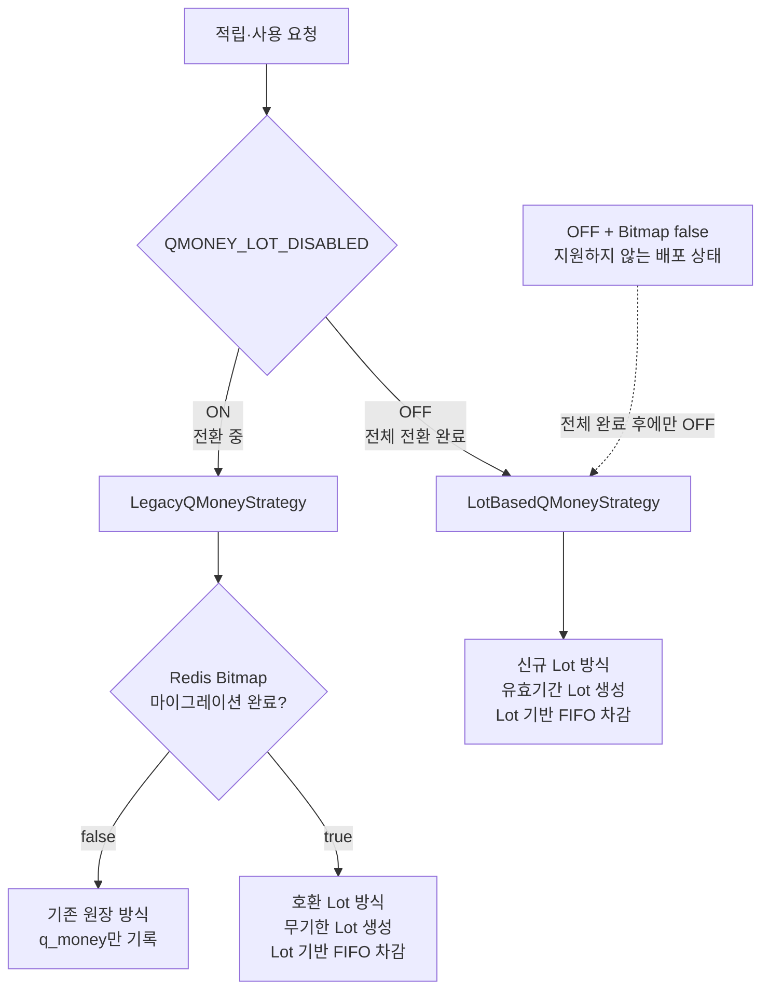
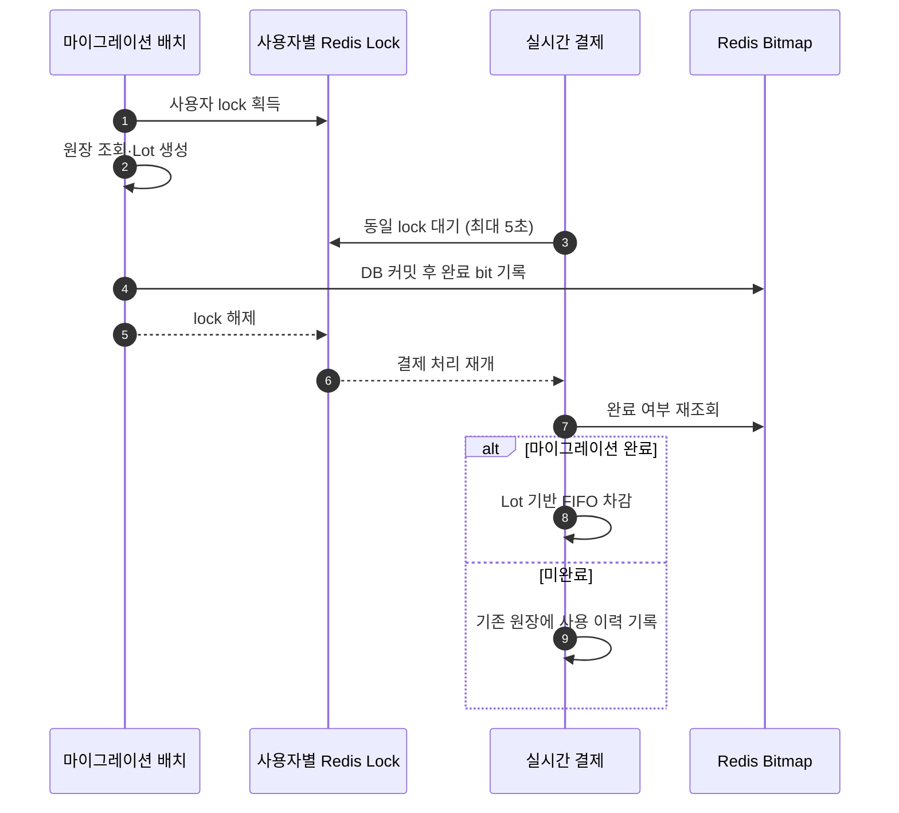

단일 거래 내역의 합계로 잔액을 계산하던 큐머니에 적립 건별 유효기간을 도입한 프로젝트입니다. 기존 원장을 유지하면서 Lot과 Usage를 추가하고, 사용자별 데이터 마이그레이션과 실시간 결제를 함께 처리했습니다.

단순한 테이블 추가보다 **마이그레이션 전·후 사용자가 공존하는 동안 잔액 정합성을 유지하고, 전체 전환 후 유효기간 정책을 활성화하는 것**이 핵심 과제였습니다.

## 큐머니 데이터 구조

기존에는 `q_money`의 적립·사용 금액 합계를 잔액으로 사용했습니다. 변경 후에는 원장, 적립 잔액, 주문별 사용 내역의 책임을 분리했습니다.


| 테이블 | 책임 |
| --- | --- |
| `q_money` | `EARN`, `USE`, `REFUND`, `EXPIRED` 거래 원장 |
| `q_money_lot` | 적립 건별 `remaining_amount`와 `expired_at` 관리 |
| `q_money_usage` | 주문이 어떤 Lot에서 얼마를 사용·환불했는지 추적 |

> 이하 각 사례의 문제, 해결, 결과는 같은 번호로 대응합니다.

## 1. 합계 기반 잔액을 적립 건별 Lot으로 전환했습니다

### 문제

1. **적립 건별 만료 관리 불가:** 전체 합계만으로는 각 적립금의 만료일과 남은 금액을 알 수 없었습니다. 예를 들어 이번 달에 만료되는 3,000원과 무기한 5,000원이 있어도 시스템에는 합계 8,000원만 남아 어떤 금액을 먼저 소멸시켜야 하는지 판단할 수 없었습니다.
2. **결제 차감 근거 부재:** 한 번의 결제가 어떤 적립 건에서 얼마씩 차감됐는지 추적할 수 없었습니다. 따라서 만료가 임박한 적립금부터 사용하는 정책이나, 부분 사용 후 각 적립 건의 잔액을 표현할 수 없었습니다.
3. **환불 유효기간 복원 불가:** 결제 취소 시 원래 사용한 적립금의 유효기간을 복원할 근거가 없었습니다. 이미 만료된 적립금까지 새 무기한 잔액으로 환불하면 사용자가 만료 정책을 우회하게 됩니다.
4. **기존 원장 호환성:** 기존 조회와 정산은 `q_money` 거래 내역을 사용하므로 이를 한 번에 교체하면 변경 범위가 커졌습니다. 신규 잔액 모델을 도입하면서도 기존 거래 내역의 의미와 이를 참조하는 기능은 계속 유지해야 했습니다.

### 해결

1. **적립 단위 Lot 도입:** `q_money_lot`에 원금, 잔액, 만료일을 저장하고 만료가 임박한 Lot부터 차감했습니다. 무기한 Lot은 마지막 순서로 배치했습니다.
2. **주문별 Usage 기록:** `q_money_usage`에 주문 ID, Lot ID, 차감액, 환불액을 저장했습니다.
3. **만료일 스냅샷 저장:** Usage에 결제 시점의 `lot_expired_at`을 함께 기록해 환불 시 원래 만료 정책을 적용했습니다.
4. **기존 원장을 유지:** `q_money`는 거래 원장으로 남기고 잔액 계산 책임만 유효한 Lot의 `remaining_amount` 합계로 옮겼습니다.

### 결과

1. **적립 건별 잔액 관리:** 부분 사용 후에도 각 Lot의 잔액과 만료일을 독립적으로 관리할 수 있게 됐습니다.
2. **차감 이력 추적:** 결제 한 건이 여러 Lot을 사용해도 Lot별 차감액을 역추적할 수 있게 됐습니다.
3. **환불 정책 보존:** 부분·다회 환불과 이미 만료된 Lot이 포함된 환불에도 원래 유효기간을 적용할 수 있게 됐습니다.
4. **점진적 구조 변경:** 기존 거래 이력과 호출부를 유지하면서 신규 잔액 모델을 도입했습니다.

## 2. 마이그레이션 전·후 사용자를 같은 서버에서 처리했습니다

### 문제

1. **서로 다른 잔액 기준의 공존:** 32만여 사용자의 데이터를 한 번에 바꿀 수 없어 전환 기간에는 마이그레이션 전·후 사용자가 같은 서버를 이용합니다. 전 사용자는 `q_money` 합계, 완료 사용자는 Lot 잔액을 사용해야 하므로 두 사용자를 구분하지 못하면 결제 실패나 잔액 불일치가 발생할 수 있었습니다.
2. **완료 상태 판별 비용:** Lot의 존재 여부는 잔액 데이터일 뿐 배치 완료 상태가 아닙니다. 요청마다 DB에서 Lot을 조회하면 적립·결제 경로에 추가 쿼리도 발생합니다. 즉, "현재 잔액이 있는가"와 "신규 방식으로 안전하게 처리해도 되는가"를 별도의 상태로 관리할 필요가 있었습니다.
3. **상태 공개 순서:** Lot 저장 전에 완료 상태가 노출되면 실시간 결제가 아직 생성되지 않은 Lot을 조회할 수 있었습니다. 완료로 판단한 결제 요청은 바로 Lot 기반 차감을 시도하므로, 데이터보다 상태가 먼저 보이는 짧은 순간에도 결제가 실패할 수 있습니다.
4. **전역 기능의 조기 활성화:** 미마이그레이션 사용자가 남은 상태에서 유효기간 기능을 켜면 모든 요청이 Lot 기반 전략으로 진입합니다. 아직 Lot이 없는 사용자는 잔액이 있어도 0원처럼 조회되거나 결제를 처리하지 못할 수 있어, 기능 활성화 시점 자체를 데이터 전환과 맞춰야 했습니다.

### 해결

1. **Feature Toggle과 Strategy:** 전환 중에는 `QMONEY_LOT_DISABLED`를 ON으로 유지했습니다. `LegacyQMoneyStrategy`가 사용자별 마이그레이션 상태에 따라 원장 방식과 호환 Lot 방식을 선택했습니다.
2. **Redis Bitmap:** 사용자 ID를 bit offset으로 사용해 `GETBIT` 한 번으로 완료 여부를 확인했습니다. 마이그레이션 완료라는 프로세스 상태를 Lot 데이터와 분리했습니다.
3. **커밋 후 완료 마킹:** 마이그레이션 Writer가 Lot 저장을 커밋한 뒤에만 `SETBIT`을 실행했습니다.
4. **전체 완료 후 Toggle 전환:** 대상 사용자 마이그레이션과 잔액 대조가 끝난 뒤 Toggle을 OFF로 바꿔 `LotBasedQMoneyStrategy`를 활성화했습니다.



### 결과

1. **혼재 구간 호환:** 같은 서버에서 마이그레이션 전 사용자는 원장 방식, 완료 사용자는 Lot 방식으로 처리했습니다.
2. **요청 경로의 상태 조회 단순화:** 운영 대상 329,050명의 상태를 O(1)로 확인했습니다. 연속 bit 기준 메모리는 약 40.2 KiB입니다.

   ```text
   329,050 bits / 8 = 41,131.25 bytes ≈ 40.2 KiB
   ```

3. **데이터와 상태의 순서 보장:** DB 커밋이 성공한 사용자만 Lot 처리 경로로 전환했습니다. 실패한 사용자는 기존 경로에 남아 재처리할 수 있었습니다.
4. **기능 활성화 시점 분리:** 서버 재배포 없이 전체 마이그레이션 완료 후 유효기간 정책을 활성화했습니다.

## 3. 기존 원장을 잔액이 일치하는 Lot으로 재구성했습니다

### 문제

1. **사용 금액의 부활:** 기존 원장은 적립과 사용을 서로 연결하지 않고 금액만 누적했습니다. 따라서 양수 이력을 그대로 Lot으로 만들면 이후 음수 이력으로 이미 사용된 금액까지 신규 잔액으로 다시 생성됩니다.
2. **적립 순서의 소실:** 현재 잔액만 하나의 Lot으로 만들면 원본 적립 건과 생성 순서를 잃어 FIFO 차감의 근거가 사라집니다. 잔액 합계는 맞더라도 어느 적립금이 먼저 만들어졌는지 알 수 없어 이후 차감 순서를 일관되게 유지할 수 없습니다.
3. **실시간 결제와의 경쟁:** 배치가 원장을 읽은 뒤 Lot을 저장하기 전에 결제가 발생하면 원장 잔액과 생성된 Lot 잔액이 달라질 수 있습니다. 예를 들어 배치가 6,000원을 읽은 직후 사용자가 1,000원을 결제하면 실제 잔액은 5,000원이지만 배치는 과거 시점의 6,000원으로 Lot을 만들게 됩니다.

```text
+5,000 적립
+3,000 적립
-2,000 사용

현재 잔액 = 6,000
양수 이력만 Lot으로 생성한 잘못된 잔액 = 8,000
```

### 해결

1. **과거 사용액 FIFO 재적용:** 적립 이력마다 Lot 후보를 만든 뒤, 과거 사용액 합계를 오래된 Lot부터 다시 차감했습니다. `remaining_amount > 0`인 Lot만 저장했습니다.
2. **원본 적립 정보 보존:** 적립 건별 Lot을 유지하고 원본 `q_money`의 생성 시각과 생성된 `lot_id`를 연결했습니다.
3. **사용자별 분산 락:** 배치와 실시간 결제가 동일한 Redis Lock을 사용했습니다. 결제는 최대 5초 대기한 뒤 Bitmap을 다시 조회해 원장 방식과 Lot 방식 중 하나를 선택했습니다.

```text
Lot A: original=5,000, remaining=3,000
Lot B: original=3,000, remaining=3,000
Lot 잔액 합계 = 6,000 = 기존 원장 잔액
```



### 결과

1. **기존 잔액 보존:** 과거 사용액이 부활하지 않고, 저장한 Lot 잔액 합계가 기존 원장 잔액과 일치하도록 변환했습니다.
2. **FIFO 기준 보존:** 마이그레이션 후에도 기존 적립 건의 생성 순서대로 차감할 수 있게 됐습니다.
3. **동시 변경 직렬화:** 한 사용자의 마이그레이션과 결제를 순차 처리해 배치 조회 시점과 저장 시점 사이의 잔액 불일치를 방지하도록 설계했습니다.

## 4. 결제와 소멸 배치가 같은 Lot을 동시에 차감하지 않게 했습니다

### 문제

1. **동일 잔액의 동시 차감:** 결제와 소멸 배치가 같은 Lot을 동시에 처리하면 두 작업이 같은 잔액을 각각 차감할 수 있었습니다. 그 결과 사용 가능한 금액보다 더 많이 차감되거나, 결제와 만료 원장이 같은 잔액을 중복 반영할 수 있습니다.
2. **대량 조회 비용:** 소멸 배치는 만료된 Lot을 반복해서 청크 단위로 조회해야 합니다. OFFSET 페이지네이션은 뒤 페이지로 갈수록 이미 처리한 행을 계속 건너뛰므로 데이터가 늘수록 스캔 비용이 커집니다.
3. **원장 내역 증가:** 한 사용자의 여러 Lot이 동시에 만료될 때 Lot마다 원장을 생성하면 거래 내역과 쓰기 건수가 늘어납니다. 사용자 관점에서는 같은 시점의 큐머니 소멸인데 여러 건으로 보이므로 내역도 불필요하게 복잡해집니다.

### 해결

1. **동일한 row lock:** 결제용 Lot 조회와 소멸 대상 조회 모두 `PESSIMISTIC_WRITE`를 사용했습니다.
2. **zero-offset 조회:** `expired_at <= now AND remaining_amount > 0` 조건에 `lastId`를 사용해 다음 청크를 읽었습니다.
3. **사용자별 만료 집계:** 여러 Lot의 잔액을 bulk update하고 사용자별 `EXPIRED` 원장을 한 건만 생성했습니다.

### 결과

1. **차감 작업 직렬화:** 결제와 소멸 배치의 동일 Lot 접근을 순차 처리했습니다.
2. **일정한 조회 기준:** 페이지가 뒤로 갈수록 OFFSET 스캔이 커지는 구조를 피했습니다.
3. **단순한 거래 원장:** 여러 Lot이 만료돼도 사용자에게는 합산된 만료 내역 한 건을 남겼습니다.
