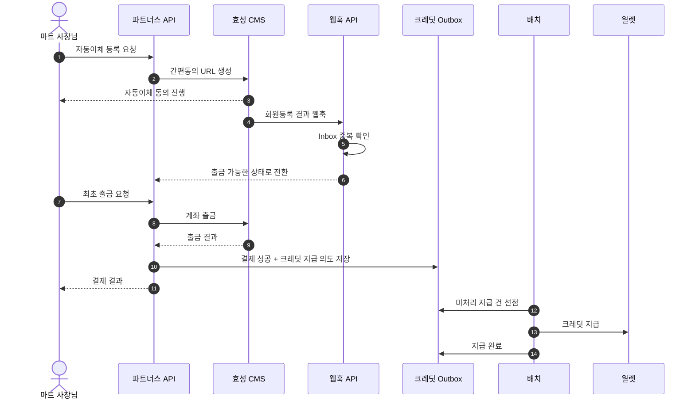
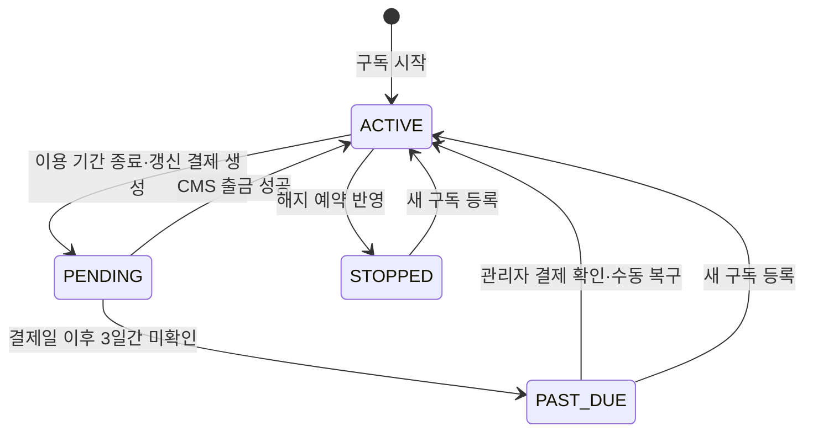

파트너사인 마트가 서비스 구독료를 효성 CMS 자동이체로 결제하고, 결제 대가로 받은 크레딧을 알림톡 발송 등에 사용하는 구독 결제·정산 시스템입니다.

자동이체 동의, CMS 회원등록 웹훅, 계좌 출금, 크레딧 지급이 서로 다른 시점에 처리됩니다. 따라서 단순 결제 API 구현보다 **중복·지연된 외부 응답과 서버 중단에도 결제 상태와 크레딧 지급을 일치시키는 것**이 핵심 과제였습니다.

## 구독 결제 처리 구조

파트너스 API는 자동이체 동의와 출금을 요청하고, 웹훅 API는 CMS 회원등록 결과를 받습니다. 출금 성공 후에는 지급할 크레딧을 Outbox에 기록하고, 배치가 월렛에 반영합니다.



> 이하 각 사례의 문제, 해결, 결과는 같은 번호로 대응합니다.

## 1. 순서가 보장되지 않는 비동기 결제를 상태 머신으로 통제했습니다

### 문제

1. **콜백 순서 불일치:** CMS 회원등록 전 출금을 성공 처리하거나, 완료된 결제를 다시 실패시키면 실제 결제 단계와 DB 상태가 달라질 수 있었습니다.
2. **중복 웹훅:** CMS가 같은 회원등록 결과를 반복 전송하면 회원 활성화와 후속 처리가 여러 번 실행될 수 있었습니다.
3. **실패 원인의 차이:** 잔액 부족·은행 통신 오류 같은 일시 실패까지 최종 실패로 닫으면 고객이 자동이체 동의부터 다시 진행해야 했습니다.

### 해결

1. **7개 상태와 전이 불변식:** 결제 등록 한 건을 상태 머신으로 만들고, 각 전이 메서드에 허용 가능한 이전 상태를 명시했습니다.

   ```mermaid
   stateDiagram-v2
       [*] --> READY
       READY --> PREPARATION_COMPLETED: CMS 회원등록 완료
       PREPARATION_COMPLETED --> WITHDRAWAL_REQUESTED: 출금 요청
       WITHDRAWAL_REQUESTED --> PAYMENT_SUCCEEDED: 출금 성공
       PAYMENT_SUCCEEDED --> COMPLETED: 크레딧 지급 완료
       WITHDRAWAL_REQUESTED --> PREPARATION_COMPLETED: 재시도 가능 실패
       WITHDRAWAL_REQUESTED --> FAILED: 재시도 불가 실패
       READY --> ABANDONED: 새 등록으로 대체
       PREPARATION_COMPLETED --> ABANDONED: 새 등록으로 대체
   ```

   출금 성공은 `WITHDRAWAL_REQUESTED`에서만, 최종 완료는 `PAYMENT_SUCCEEDED`에서만 허용했습니다. 서비스가 순서를 놓쳐도 도메인 객체가 잘못된 전이를 거부합니다.

2. **Inbox 멱등 처리:** 외부 식별자 `agreementSimpleId`를 PK로 웹훅을 먼저 저장했습니다. 이미 저장된 웹훅은 후속 로직을 실행하지 않고 동일한 성공 응답을 반환했습니다.
3. **실패 코드 분류:** CMS 응답을 재시도 가능·불가능으로 나눴습니다. 일시 실패는 `PREPARATION_COMPLETED`로 되돌리고, 확정 실패만 `FAILED`로 종료했습니다.

### 결과

1. **상태 정합성:** 허용하지 않은 콜백 순서는 도메인 계층에서 거부되어 잘못된 결제 상태가 저장되는 것을 막았습니다.
2. **중복 부수효과 차단:** 같은 웹훅이 반복되어도 회원 활성화와 결제 부수효과를 다시 실행하지 않도록 했습니다.
3. **출금 재시도 UX:** 일시 실패 시 자동이체 동의를 다시 받지 않고 출금 단계부터 재시도할 수 있게 했습니다.

## 2. 출금과 크레딧 지급 사이의 유실을 Outbox로 복구했습니다

### 문제

1. **지급 의도 유실:** 계좌 출금 성공을 저장한 직후 서버가 중단되면 돈은 빠졌지만 크레딧 지급 작업은 남지 않을 수 있었습니다.
2. **긴 트랜잭션:** 출금 성공 처리와 크레딧 지급을 하나의 트랜잭션으로 묶으면 지급이 끝날 때까지 DB 자원을 점유하게 됩니다.
3. **재처리 중복:** 처리 도중 서버가 중단되거나 여러 인스턴스가 같은 작업을 가져가면 동일 크레딧이 반복 지급될 수 있었습니다.

### 해결

1. **Transactional Outbox:** 출금 성공 트랜잭션에서 크레딧을 직접 지급하지 않고 `CmsSubscriptionCreditOutbox`에 지급 의도를 함께 저장했습니다. 결제 성공과 후속 작업이 하나의 커밋으로 남습니다.
2. **트랜잭션 경계 분리:** `행 선점 → 크레딧 지급 → 성공·실패 기록`을 각각 분리했습니다. 크레딧 지급 중에는 Outbox 행의 DB 락을 유지하지 않습니다.
3. **선점·회수·멱등성 결합:** 비관적 락으로 Outbox를 선점하고, 5분 이상 `PROCESSING`에 머문 작업은 다시 회수했습니다. 청구 주기별 원장 `transactionId`에는 UNIQUE 제약을 두었습니다.

### 결과

1. **지급 의도 보존:** 출금 성공과 크레딧 지급 의도 사이의 영구 유실 경로를 제거했습니다.
2. **짧은 트랜잭션:** 후속 지급을 독립 처리해 출금 성공 트랜잭션의 범위를 줄였습니다.
3. **재처리 안정성:** 서버 중단과 다중 인스턴스 처리가 겹쳐도 미완료 작업은 다시 이어가고, 이미 지급된 건은 중복 반영하지 않도록 했습니다.

| 장애 시점 | 남는 상태 | 복구 방식 |
| --- | --- | --- |
| 출금 성공 처리 전 | 결제 미완료 | 출금 결과에 따라 재시도·실패 처리 |
| 출금 성공 후, 지급 전 | Outbox `PENDING` | 다음 배치가 처리 |
| 지급 처리 중 서버 중단 | Outbox `PROCESSING` | 5분 후 stale 회수 |
| 지급 완료 후 완료 기록 전 | 동일 이벤트 재발행 가능 | 원장 `transactionId` UNIQUE로 중복 방지 |

## 3. 구독 상태 전이 모델로 결제 실패와 서비스 이용 상태를 분리했습니다

### 문제

1. **일시 실패로 인한 즉시 만료:** 갱신일에 출금이 한 번 실패했다고 구독을 바로 만료시키면 잔액 부족이나 은행 지연만으로 서비스가 중단됩니다.
2. **상태 의미 혼재:** "현재 서비스를 이용할 수 있는가"와 "다음 결제가 완료됐는가"를 하나의 상태로 표현하면 갱신일 전후의 의미가 모호해집니다.
3. **출금 결과 미확정:** CMS 호출 직후 서버가 중단되면 실제 출금 여부를 로컬 상태만으로 판단할 수 없습니다.

### 해결

1. **3일 유예 상태:** 구독 종료일이 도래하면 즉시 만료하지 않고 `ACTIVE → PENDING`으로 전환했습니다. 결제일 이후 3일까지 출금 확인을 기다립니다.
2. **구독·청구·결제 상태 분리:** 구독은 이용 상태, `BillingCycle`은 청구 상태, `Payment`는 CMS 출금 상태를 담당하게 했습니다.
3. **수동 복구 경로:** 3일 동안 결제가 확인되지 않으면 `PAST_DUE`로 전환합니다. 출금 여부가 불명확한 건은 관리자가 실제 내역을 확인한 뒤 실패 청구 주기와 구독을 `ACTIVE`로 복구할 수 있게 했습니다.



| 구독 상태 | 의미 | 함께 존재하는 결제 상태 |
| --- | --- | --- |
| `ACTIVE` | 결제가 확인된 정상 이용 상태 | `BillingCycle.PAID`, `Payment.COMPLETED` |
| `PENDING` | 다음 결제를 기다리는 3일 유예기간 | `BillingCycle.PENDING`, `Payment.READY` |
| `PAST_DUE` | 유예기간까지 결제가 확인되지 않음 | `BillingCycle.FAILED` |
| `STOPPED` | 해지되었거나 새 구독으로 대체됨 | 종료 상태 |

### 결과

1. **서비스 연속성:** 일시적인 결제 실패가 즉시 서비스 해지로 이어지지 않도록 3일의 복구 시간을 확보했습니다.
2. **명확한 상태 의미:** 구독 이용 상태와 개별 결제 진행 상태의 책임을 분리해 갱신일 전후의 상태를 일관되게 해석할 수 있게 했습니다.
3. **운영 복구 가능성:** 자동 판단이 위험한 출금 건은 운영자가 실제 자금 이동을 확인한 뒤 복구할 수 있게 했습니다.
