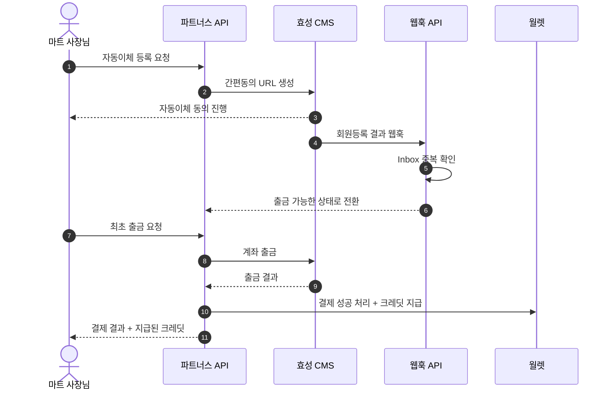
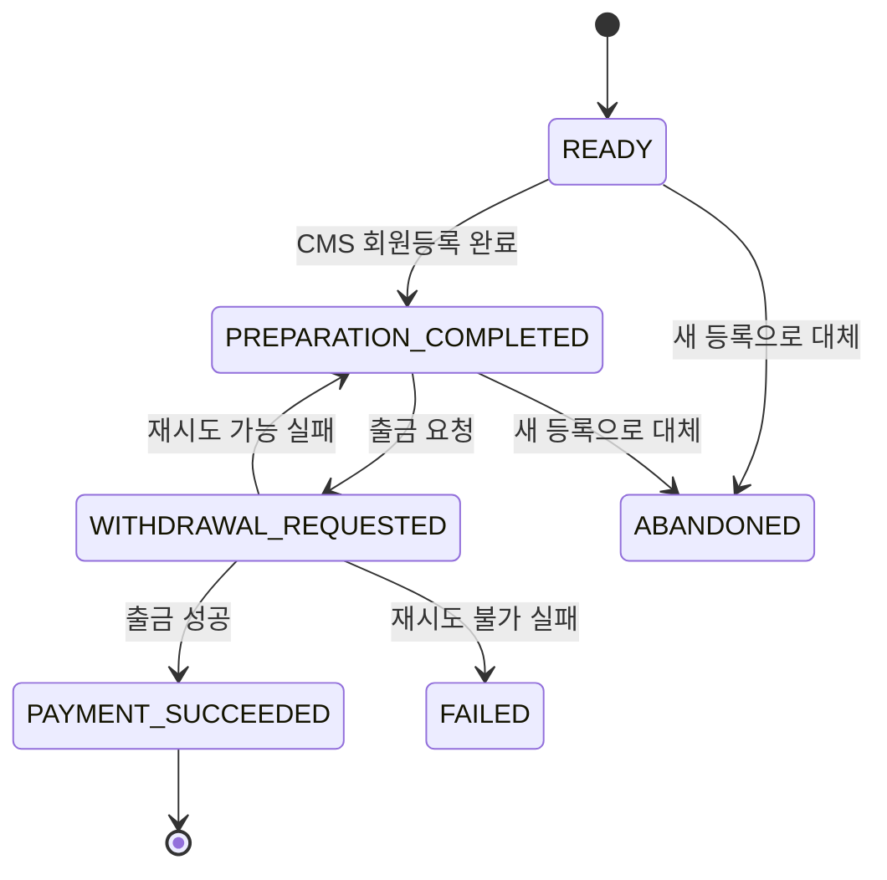
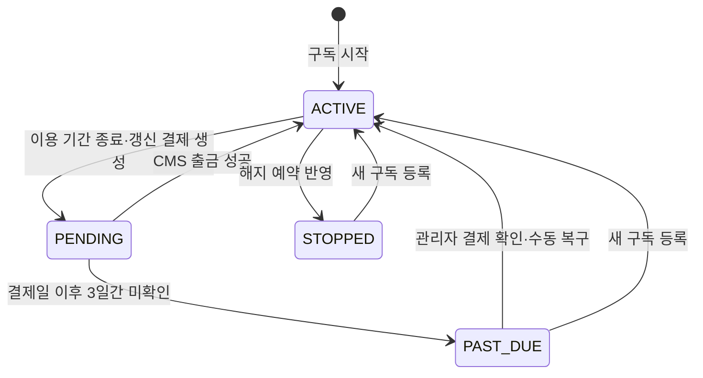

파트너사인 마트가 서비스 구독료를 효성 CMS 자동이체로 결제하고, 결제 대가로 받은 크레딧을 알림톡 발송 등에 사용하는 구독 결제·정산 시스템입니다.

자동이체 동의, CMS 회원등록 웹훅, 계좌 출금이 서로 다른 시점에 처리됩니다. 따라서 단순 결제 API 구현보다 **중복·지연된 외부 응답과 서버 중단에도 결제 상태와 크레딧 지급을 일치시키는 것**이 핵심 과제였습니다.

## 구독 결제 처리 구조

파트너스 API는 자동이체 동의와 출금을 요청하고, 웹훅 API는 CMS 회원등록 결과를 받습니다. 같은 웹훅 경로로 결제수단 변경 결과도 처리합니다. 출금에 성공하면 그 시점에 크레딧을 월렛에 바로 지급합니다.

```mermaid
sequenceDiagram
    autonumber
    actor Mart as 마트 사장님
    participant API as 파트너스 API
    participant CMS as 효성 CMS
    participant Webhook as 웹훅 API
    participant Wallet as 월렛

    Mart ->> API: 자동이체 등록 요청
    API ->> CMS: 간편동의 URL 생성
    CMS -->> Mart: 자동이체 동의 진행
    CMS ->> Webhook: 회원등록 결과 웹훅
    Webhook ->> Webhook: Inbox 중복 확인
    Webhook -->> API: 출금 가능한 상태로 전환
    Mart ->> API: 최초 출금 요청
    API ->> CMS: 계좌 출금
    CMS -->> API: 출금 결과
    API ->> Wallet: 결제 성공 처리 + 크레딧 지급
    API -->> Mart: 결제 결과 + 지급된 크레딧
```

## 1. 6-상태 상태 머신과 Inbox 멱등 처리를 통한 비동기 결제 정합성 확보

#### 6개 상태와 전이 불변식

- **문제:** CMS 회원등록 전 출금을 성공 처리하거나, 완료된 결제를 다시 실패시키면 실제 결제 단계와 DB 상태가 달라질 수 있었습니다.
- **해결:** 결제 등록 한 건을 상태 머신으로 만들고, 각 전이 메서드에 허용 가능한 이전 상태를 명시했습니다. 출금 성공은 `WITHDRAWAL_REQUESTED`에서만 허용하고, 출금에 성공한 등록은 실패나 폐기로 되돌릴 수 없게 했습니다. `PAYMENT_SUCCEEDED`는 실제로 돈이 움직였다는 사실이고 크레딧도 이 시점에 함께 지급되므로, 등록 이력은 여기서 끝납니다.
- **결과:** 허용하지 않은 콜백 순서는 도메인 계층에서 거부되어, 서비스가 순서를 놓쳐도 잘못된 결제 상태가 저장되지 않습니다.

```mermaid
stateDiagram-v2
    [*] --> READY
    READY --> PREPARATION_COMPLETED: CMS 회원등록 완료
    PREPARATION_COMPLETED --> WITHDRAWAL_REQUESTED: 출금 요청
    WITHDRAWAL_REQUESTED --> PAYMENT_SUCCEEDED: 출금 성공
    WITHDRAWAL_REQUESTED --> PREPARATION_COMPLETED: 재시도 가능 실패
    WITHDRAWAL_REQUESTED --> FAILED: 재시도 불가 실패
    READY --> ABANDONED: 새 등록으로 대체
    PREPARATION_COMPLETED --> ABANDONED: 새 등록으로 대체
    PAYMENT_SUCCEEDED --> [*]
```

#### Inbox 멱등 처리

- **문제:** CMS가 같은 회원등록 결과를 반복 전송하면 회원 활성화와 후속 처리가 여러 번 실행될 수 있었습니다.
- **해결:** 외부 식별자 `agreementSimpleId`를 PK로 웹훅을 먼저 저장했습니다. 이미 저장된 웹훅은 후속 로직을 실행하지 않고 동일한 성공 응답을 반환했습니다.
- **결과:** 같은 웹훅이 반복되어도 회원 활성화와 결제 부수효과를 다시 실행하지 않습니다.

#### 실패 코드 분류

- **문제:** 잔액 부족·은행 통신 오류 같은 일시 실패까지 최종 실패로 닫으면 고객이 자동이체 동의부터 다시 진행해야 했습니다.
- **해결:** CMS 응답을 재시도 가능·불가능으로 나눴습니다. 일시 실패는 `PREPARATION_COMPLETED`로 되돌리고, 확정 실패만 `FAILED`로 종료했습니다.
- **결과:** 일시 실패 시 자동이체 동의를 다시 받지 않고 출금 단계부터 재시도할 수 있습니다.

#### 정합화 배치

- **문제:** 사용자가 동의를 중단하거나 웹훅이 진행 중 상태만 전달하면, 등록이 결과를 기다리는 상태로 남습니다.
- **해결:** 결과를 기다리는 `READY` 등록을 배치가 훑어 CMS에 회원 상태를 직접 조회했습니다. 동의가 끝난 건은 회원 생성과 준비 완료 전이를 이어서 진행하고, 제한 시간을 넘긴 건은 `FAILED`로 닫았습니다. 웹훅과 같은 건을 두고 경쟁하므로 등록 행에 락을 잡고 `READY`를 다시 확인한 뒤 진행하고, 외부 조회는 트랜잭션 밖에서 일괄로 끝냈습니다.
- **결과:** 웹훅이 도착하지 않아도 등록이 결과를 기다리는 상태로 남지 않습니다.

## 2. 구독·청구·결제 상태 분리와 3일 유예를 통한 결제 실패 시 서비스 연속성 확보

#### 3일 유예 상태

- **문제:** 갱신일에 출금이 한 번 실패했다고 구독을 바로 만료시키면 잔액 부족이나 은행 지연만으로 서비스가 중단됩니다.
- **해결:** 구독 종료일이 도래하면 즉시 만료하지 않고 `ACTIVE → PENDING`으로 전환했습니다. 결제일 이후 3일까지 출금 확인을 기다립니다.
- **결과:** 일시적인 결제 실패가 즉시 서비스 해지로 이어지지 않도록 3일의 복구 시간을 확보했습니다.

```mermaid
stateDiagram-v2
    [*] --> ACTIVE: 구독 시작
    ACTIVE --> PENDING: 이용 기간 종료·갱신 결제 생성
    PENDING --> ACTIVE: CMS 출금 성공
    PENDING --> PAST_DUE: 결제일 이후 3일간 미확인
    PAST_DUE --> ACTIVE: 관리자 결제 확인·수동 복구
    ACTIVE --> STOPPED: 해지 예약 반영
    PAST_DUE --> ACTIVE: 새 구독 등록
    STOPPED --> ACTIVE: 새 구독 등록
```

#### 구독·청구·결제 상태 분리

- **문제:** "현재 서비스를 이용할 수 있는가"와 "다음 결제가 완료됐는가"를 하나의 상태로 표현하면 갱신일 전후의 의미가 모호해집니다.
- **해결:** 구독(`Subscription`)은 이용 상태, `BillingCycle`은 청구 상태, 결제(`PartnersPayment`)은 CMS 출금 시도의 결과를 담당하게 했습니다. `PartnersPayment`는 실제로 출금을 요청하는 시점에 만듭니다.
- **결과:** 구독 이용 상태와 개별 결제 진행 상태의 책임을 분리해 갱신일 전후의 상태를 일관되게 해석할 수 있습니다.

| 구독 상태      | 의미                  | 청구 주기 상태  | PartnersPayment    |
| ---------- | ------------------- | --------- | ------------------ |
| `ACTIVE`   | 결제가 확인된 정상 이용 상태    | `PAID`    | `COMPLETED`        |
| `PENDING`  | 다음 결제를 기다리는 3일 유예기간 | `PENDING` | 출금을 요청하기 전까지 없음    |
| `PAST_DUE` | 유예기간까지 결제가 확인되지 않음  | `FAILED`  | 출금을 시도했다면 `FAILED` |
| `STOPPED`  | 해지되었거나 새 구독으로 대체됨   | 종료 상태     | —                  |
